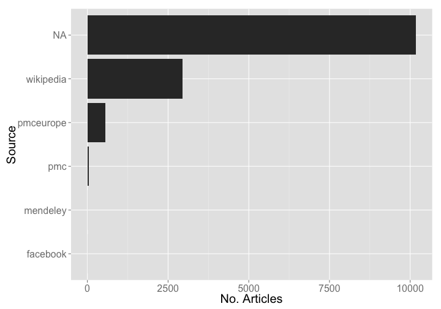

Crossref Report
========================================================


### Date 

Compiled on 2014-10-08 22:06:38

### Setup

> change directory to /data-quality/alerts/


Install `alm` if not installed already, then load package


```r
# source helper fxns
source("helper_fxns.R")

# install.packages('stringr')
# devtools::install_github("ropensci/alm", ref="dev")
library('stringr')
library('alm')
library('plyr')
library('dplyr')
library('tidyr')
library('assertthat')
library('ggplot2')
library('lubridate')
```


### Set up variables


```r
url <- "http://det.labs.crossref.org/api/v4/alerts"
user <- getOption('almv4_crossref_user')
pwd <- getOption('almv4_crossref_pwd')
cr_v5_key <- getOption('crossrefalmkey')
```

### Get all data


```r
meta <- alm_alerts(url = url, user = user, pwd = pwd)$meta
res <- lapply(1:meta$total_pages, function(x) alm_alerts(page=x, url=url, user=user, pwd=pwd))
(resdf <- do.call(rbind, lapply(res, "[[", "data")) %>% 
   tbl_df %>% 
   select(id, level, class_name, article, status, source, create_date, target_url))
```

```
## Source: local data frame [5,292 x 8]
## 
##       id level                  class_name                      article
## 1  49206 ERROR ActiveRecord::RecordInvalid                           NA
## 2  49207 ERROR ActiveRecord::RecordInvalid                           NA
## 3  49205 ERROR ActiveRecord::RecordInvalid                           NA
## 4  49204 ERROR ActiveRecord::RecordInvalid                           NA
## 5  49203 ERROR               StandardError                           NA
## 6  49202 ERROR               StandardError                           NA
## 7  49201  WARN Net::HTTPServiceUnavailable 10.1080/1551806x.2014.897883
## 8  49198  WARN     Net::HTTPRequestTimeOut                           NA
## 9  49199  WARN     Net::HTTPRequestTimeOut                           NA
## 10 49200  WARN     Net::HTTPRequestTimeOut                           NA
## ..   ...   ...                         ...                          ...
## Variables not shown: status (dbl), source (chr), create_date (chr),
##   target_url (chr)
```

### Visual exploration of alerts

#### type of alerts


```r
library(ggplot2)
resdf %>%
  group_by(class_name) %>%
  summarise(number = length(class_name)) %>%
  ggplot(aes(reorder(class_name, number), number)) +
    geom_histogram(stat = "identity") + 
    coord_flip() +
    theme_grey(base_size = 20) +
    labs(x = "Alert", y = "No. Articles")
```

 

#### alerts by source

By source alone

> NOTE: the NA's are not mistakes, but what is given as the source


```r
resdf %>%
  group_by(source) %>%
  summarise(number = length(source)) %>%
  ggplot(aes(reorder(source, number), number)) +
    geom_histogram(stat = "identity") + 
    coord_flip() +
    theme_grey(base_size = 20) +
    labs(x = "Source", y = "No. Articles")
```

 

source X alert class


```r
resdf %>%
  group_by(source, class_name) %>%
  summarise(number = length(source)) %>%
  ggplot(aes(reorder(class_name, number), number, fill=source)) +
    geom_histogram(stat = "identity") + 
    coord_flip() +
    theme_grey(base_size = 20) +
    labs(x = "Source", y = "No. Articles") +
    theme(legend.position = "top")
```

 

Dig into `Net::HTTPForbidden`


```r
library('httr')
library('jsonlite')
```

```
## 
## Attaching package: 'jsonlite'
## 
## The following object is masked from 'package:utils':
## 
##     View
```

```r
res <- GET('http://det.labs.crossref.org//api/v5/publishers', query=list(api_key=cr_v5_key))
prefixes <- fromJSON(content(res, "text"))$data[,c('name','prefixes')]
pre <- prefixes$prefixes
names(pre) <- prefixes$name
```

Define functions


```r
splitdoi <- function(x) strsplit(x, "/")[[1]][[1]]
match_publisher <- function(x, y){
  names(y[ sapply(y, function(z) x %in% z) ])
}
```

Manipulate data


```r
# subset data
dat <- resdf %>%
  filter(class_name == "Net::HTTPForbidden") %>%
  mutate(prefix = splitdoi(article)) %>%
  select(id, level, class_name, article, prefix, status, source, create_date, target_url)

# get publishers
pubs <- dat %>%
  rowwise %>%
  do( publisher = match_publisher(.$prefix, pre) )

# join the two data.frame's
alldf <- tbl_df(cbind(dat, pubs))
alldf$publisher <- as.character(alldf$publisher)
unique(alldf$publisher)
```

```
## [1] "Wiley-Blackwell"
```

> Note: How all these `Net::HTTPForbidden` erors are 403 errors, and all from Wiley, trying to get Wikipedia data source

The only alert class with article IDs is `Net::HTTPForbidden`.
