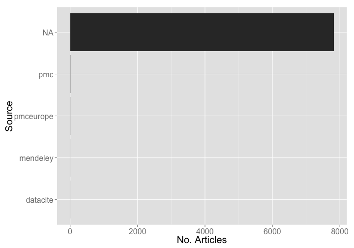
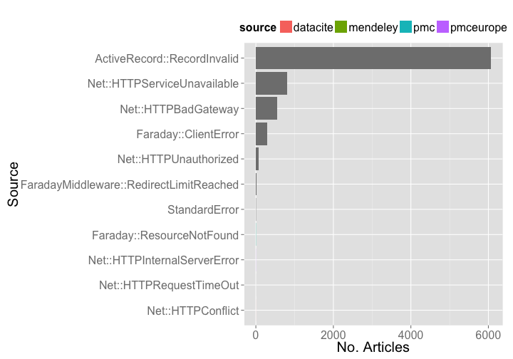

Crossref Report
========================================================


### Date 

Compiled on 2014-10-21 18:43:12

### Setup

> change directory to /data-quality/alerts/crossref_report


Install `alm` if not installed already, then load package


```r
#' Function to parse alerts messages differenlty depending on the alert class
#'
#' @param x Input data.frame from a call to \code{alm_alerts()}
#' @param class Class of alert. See \code{alert_classes()} for alert classes
#' @examples \donttest{
#' rs <- alm_alerts()
#' head( alerts_parse(rs) )
#' 
#' rs <- alm_alerts(class_name = "HtmlRatioTooHighError")
#'
#' # Parse messages from alerts into new columns
#' # doesn't matter if you have one class or many in the dataset
#' head( alerts_parse(x = rs$data) )
#' 
#' rs <- alm_alerts(class_name = 'DelayedJobError')
#' head( alerts_parse(x = rs$data) )
#' }

alerts_parse <- function(x){
  df <- tbl_df(x)
  out <- df %>% 
    rowwise() %>% 
    do(parser(class=.$class_name, mssg=.$message))
  data.frame(x, out, stringsAsFactors = FALSE)
}

foo <- function(x){
  tt <- as.numeric(str_extract_all(x, "[0-9]+")[[1]])
  data.frame(from=tt[1], to=tt[2], val=tt[1] - tt[2], stringsAsFactors = FALSE)
}

bar <- function(y) data.frame(val=as.numeric(vapply(y, str_extract, character(1), pattern="[0-9]+", USE.NAMES = FALSE)), stringsAsFactors = FALSE)

parser <- function(class, mssg){
  if(class %in% c('HtmlRatioTooHighError','EventCountDecreasingError','EventCountIncreasingTooFastError','ArticleNotUpdatedError')){
    switch(class,
           HtmlRatioTooHighError = data.frame(val=as.numeric(str_extract(mssg, "[0-9]+\\.?[0-9]+"))),
           EventCountDecreasingError = foo(mssg),
           EventCountIncreasingTooFastError = bar(mssg),
           ArticleNotUpdatedError = bar(mssg)
    )
  } else { data.frame(val=NA, stringsAsFactors = FALSE) }
}

alerts_by_class <- function(class_name=NULL, limit=NULL){
  assert_that(!is.null(class_name))
  num_res <- alm_alerts(class_name = class_name)$meta$total
  if(!is.null(limit)) num_res <- min(c(num_res, limit))
  if(!num_res == 0){
    pgs <- 1:(round_any(num_res, 50, ceiling)/50)
    xx <- rbind.fill(lapply(pgs, function(x) alm_alerts(page=x, class_name = class_name)$data))
    xx <- alerts_parse(xx)
    xx <- xx[ !duplicated(xx[,!names(xx) %in% c('id','create_date',"unresolved")]) , ]
    tmp <- 
      if(class_name=="EventCountDecreasingError"){
        tbl_df(xx) %>% select(id, article, val, from, to, create_date, source) 
      } else { tbl_df(xx) %>% select(id, article, val, create_date, source) }
    tmp %>%
      arrange(desc(val)) %>%
      mutate(class = class_name)
  } else { tbl_df(data.frame(NULL)) }
}

clean_events <- function(x){
  tmp <- lapply(x, function(y){
    if(is.character(y)){
      if(y == "sorry, no events content yet") NULL else y 
    } else { y }
  })
  compact(tmp)
}

add_events_data <- function(dat, x){
  events <- alm_events(x, source = "counter")
  foo <- function(x, y){
    tmp <- x$counter$events
    data.frame(article=y, tmp, stringsAsFactors = FALSE)
  }
  events <- Map(foo, events, names(events))
  eventsdf <- tbl_df(rbind_all(events))
  tmpdf <- inner_join(x=eventsdf, y=dat)
  tmpdf <- tmpdf %>% 
    mutate(date = as.Date(sprintf('%s-%s-01', year, month)), ratio = htmlpdfr(html_views, pdf_views))
  tmpdf$create_date <- as.Date(ymd_hms(tmpdf$create_date))
  tmpdf
}

htmlpdfr <- function(x, y){
  x <- ifelse(x == 0, 1, x)
  y <- ifelse(y == 0, 1, y)
  x/y
}

rbind_all_named <- function(dat){
  tmp <- Map(function(x, y){ x$doi <- y; x }, dat, names(dat))
  rbind_all(tmp)
}
```


```r
# source helper fxns
# source("helper_fxns.R")

# install.packages('stringr')
# devtools::install_github("ropensci/alm", ref="dev")
library('stringr')
library('alm')
library('plyr')
library('dplyr')
library('tidyr')
library('assertthat')
library('ggplot2')
library('lubridate')
library('knitr')
```


### Set up variables


```r
url <- "http://det.labs.crossref.org/api/v4/alerts"
user <- getOption('almv4_crossref_user')
pwd <- getOption('almv4_crossref_pwd')
cr_v5_key <- getOption('crossrefalmkey')
```

### Get all data


```r
meta <- alm_alerts(url = url, user = user, pwd = pwd)$meta
res <- lapply(1:meta$total_pages, function(x) alm_alerts(page=x, url=url, user=user, pwd=pwd))
(resdf <- do.call(rbind, lapply(res, "[[", "data")) %>% 
   tbl_df %>% 
   select(id, level, class_name, article, status, source, create_date, target_url))
```

```
## Source: local data frame [7,827 x 8]
## 
##       id level                  class_name article status   source
## 1  57666 ERROR               StandardError      NA     NA       NA
## 2  57665 ERROR               StandardError      NA     NA       NA
## 3  57664 ERROR               StandardError      NA     NA       NA
## 4  57663 ERROR               StandardError      NA     NA       NA
## 5  57662 ERROR           Net::HTTPConflict      NA    409 datacite
## 6  57661 ERROR               StandardError      NA     NA       NA
## 7  57660 ERROR               StandardError      NA     NA       NA
## 8  57659 ERROR ActiveRecord::RecordInvalid      NA     NA       NA
## 9  57658 ERROR ActiveRecord::RecordInvalid      NA     NA       NA
## 10 57657 ERROR ActiveRecord::RecordInvalid      NA     NA       NA
## ..   ...   ...                         ...     ...    ...      ...
## Variables not shown: create_date (chr), target_url (chr)
```

### Types of errors


```r
tabl <- resdf %>%
  group_by(class_name) %>%
  summarise(n = n()) %>%
  arrange(desc(n))

kable(tabl, format = "markdown")
```


|class_name                              |    n|
|:---------------------------------------|----:|
|ActiveRecord::RecordInvalid             | 6067|
|Net::HTTPServiceUnavailable             |  814|
|Net::HTTPBadGateway                     |  545|
|Faraday::ClientError                    |  285|
|Net::HTTPUnauthorized                   |   79|
|FaradayMiddleware::RedirectLimitReached |   21|
|StandardError                           |    7|
|Faraday::ResourceNotFound               |    5|
|Net::HTTPInternalServerError            |    2|
|Net::HTTPConflict                       |    1|
|Net::HTTPRequestTimeOut                 |    1|


### Alerts by source

By source alone

> NOTE: the NA's are not mistakes, but what is given as the source


```r
resdf %>%
  group_by(source) %>%
  summarise(n = n()) %>%
  ggplot(aes(reorder(source, n), n)) +
    geom_histogram(stat = "identity") + 
    coord_flip() +
    theme_grey(base_size = 20) +
    labs(x = "Source", y = "No. Articles")
```

 

source X alert class


```r
resdf %>%
  group_by(source, class_name) %>%
  summarise(n = n()) %>%
  ggplot(aes(reorder(class_name, n), n, fill=source)) +
    geom_histogram(stat = "identity") + 
    coord_flip() +
    theme_grey(base_size = 20) +
    labs(x = "Source", y = "No. Articles") +
    theme(legend.position = "top")
```

 

### Dig into Net::HTTPForbidden errors


```r
library('httr')
library('jsonlite')
res <- GET('http://det.labs.crossref.org/api/v5/publishers', query=list(api_key=cr_v5_key))
prefixes <- fromJSON(content(res, "text"))$data[,c('name','prefixes')]
pre <- prefixes$prefixes
names(pre) <- prefixes$name
```

Define functions


```r
splitdoi <- function(x) strsplit(x, "/")[[1]][[1]]
match_publisher <- function(x, y){
  names(y[ sapply(y, function(z) x %in% z) ])
}
```

Manipulate data


```r
# subset data
most <- resdf %>%
  group_by(class_name) %>%
  summarise(n = n()) %>%
  arrange(desc(n)) %>%
  data.frame(.)

dat <- resdf %>%
  filter(class_name == most[1,"class_name"]) %>%
  mutate(prefix = splitdoi(article)) %>%
  select(id, level, class_name, article, prefix, status, source, create_date, target_url)

# get publishers
pubs <- dat %>%
  rowwise %>%
  do( publisher = match_publisher(.$prefix, pre) )

# join the two data.frame's
alldf <- tbl_df(cbind(dat, pubs))
alldf$publisher <- as.character(alldf$publisher)
unique(alldf$publisher)
```

```
## [1] "character(0)"
```
