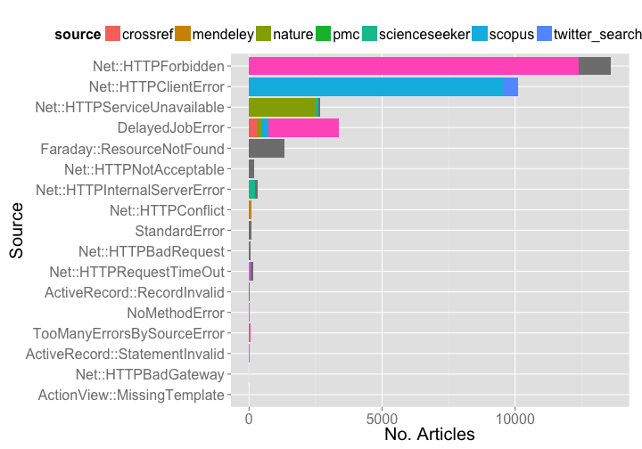

Crossref Report
========================================================


### Date 

Compiled on 2014-10-23 10:47:14

### Setup

> change directory to /data-quality/alerts


Install `alm` if not installed already, then load package


```r
# source functions
source("helper_fxns.R")

# install.packages('stringr')
# devtools::install_github("ropensci/alm", ref="dev")
library('stringr')
library('alm')
library('plyr')
library('dplyr')
library('tidyr')
library('assertthat')
library('ggplot2')
library('lubridate')
library('knitr')
```


```r
knitr::purl("alertssetup.Rmd")
source("alertssetup.R")
unlink("alertssetup.R")
```

### Set up variables


```r
url <- "http://det.labs.crossref.org/api/v4/alerts"
user <- getOption('almv4_crossref_user')
pwd <- getOption('almv4_crossref_pwd')
cr_v5_key <- getOption('crossrefalmkey')
```

### Get all data


```r
meta <- alm_alerts(url = url, user = user, pwd = pwd)$meta
res <- lapply(1:meta$total_pages, function(x) alm_alerts(page=x, url=url, user=user, pwd=pwd))
(resdf <- do.call(rbind, lapply(res, "[[", "data")) %>% 
   tbl_df %>% 
   select(id, level, class_name, article, status, source, create_date, target_url))
```

```
## Source: local data frame [7,842 x 8]
## 
##       id level              class_name               article status
## 1  57681 ERROR       Net::HTTPConflict                    NA    409
## 2  57680 ERROR       Net::HTTPConflict                    NA    409
## 3  57679 ERROR       Net::HTTPConflict                    NA    409
## 4  57678 ERROR       Net::HTTPConflict                    NA    409
## 5  57677 ERROR       Net::HTTPConflict                    NA    409
## 6  57676 ERROR       Net::HTTPConflict                    NA    409
## 7  57675  WARN Net::HTTPRequestTimeOut 10.3917/litt.161.0097    408
## 8  57674 ERROR           StandardError                    NA     NA
## 9  57673 ERROR           StandardError                    NA     NA
## 10 57672 ERROR       Net::HTTPConflict                    NA    409
## ..   ...   ...                     ...                   ...    ...
## Variables not shown: source (chr), create_date (chr), target_url (chr)
```

### Types of errors


```r
tabl <- resdf %>%
  group_by(class_name) %>%
  summarise(n = n()) %>%
  arrange(desc(n))

kable(tabl, format = "markdown")
```


|class_name                              |    n|
|:---------------------------------------|----:|
|ActiveRecord::RecordInvalid             | 6067|
|Net::HTTPServiceUnavailable             |  814|
|Net::HTTPBadGateway                     |  545|
|Faraday::ClientError                    |  285|
|Net::HTTPUnauthorized                   |   79|
|FaradayMiddleware::RedirectLimitReached |   21|
|Net::HTTPConflict                       |   13|
|StandardError                           |    9|
|Faraday::ResourceNotFound               |    5|
|Net::HTTPInternalServerError            |    2|
|Net::HTTPRequestTimeOut                 |    2|


### Alerts by source

By source alone

> NOTE: the NA's are not mistakes, but what is given as the source


```r
resdf %>%
  group_by(source) %>%
  summarise(n = n()) %>%
  ggplot(aes(reorder(source, n), n)) +
    geom_histogram(stat = "identity") + 
    coord_flip() +
    theme_grey(base_size = 20) +
    labs(x = "Source", y = "No. Articles")
```

 

source X alert class


```r
resdf %>%
  group_by(source, class_name) %>%
  summarise(n = n()) %>%
  ggplot(aes(reorder(class_name, n), n, fill=source)) +
    geom_histogram(stat = "identity") + 
    coord_flip() +
    theme_grey(base_size = 20) +
    labs(x = "Source", y = "No. Articles") +
    theme(legend.position = "top")
```

 

### Dig into Net::HTTPForbidden errors


```r
library('httr')
library('jsonlite')
res <- GET('http://det.labs.crossref.org/api/v5/publishers', query=list(api_key=cr_v5_key))
prefixes <- fromJSON(content(res, "text"))$data[,c('name','prefixes')]
pre <- prefixes$prefixes
names(pre) <- prefixes$name
```

Define functions


```r
splitdoi <- function(x) strsplit(x, "/")[[1]][[1]]
match_publisher <- function(x, y){
  names(y[ sapply(y, function(z) x %in% z) ])
}
```

Manipulate data


```r
# subset data
most <- resdf %>%
  group_by(class_name) %>%
  summarise(n = n()) %>%
  arrange(desc(n)) %>%
  data.frame(.)

dat <- resdf %>%
  filter(class_name == most[1,"class_name"]) %>%
  mutate(prefix = splitdoi(article)) %>%
  select(id, level, class_name, article, prefix, status, source, create_date, target_url)

# get publishers
pubs <- dat %>%
  rowwise %>%
  do( publisher = match_publisher(.$prefix, pre) )

# join the two data.frame's
alldf <- tbl_df(cbind(dat, pubs))
alldf$publisher <- as.character(alldf$publisher)
unique(alldf$publisher)
```

```
## [1] "character(0)"
```
