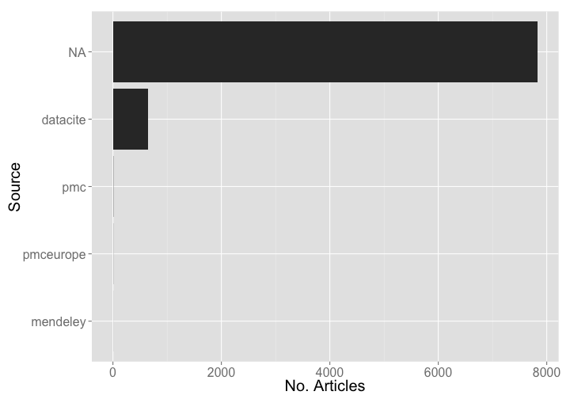
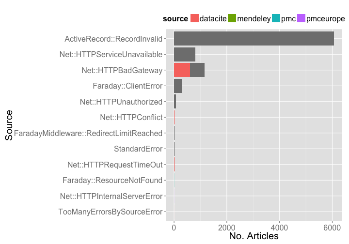

Crossref Report
========================================================


### Date 

Compiled on 2014-10-28 22:29:58

### Setup

> change directory to /data-quality/alerts


Install `alm` if not installed already, then load package


```r
# source functions
source("helper_fxns.R")

# install.packages('stringr')
# devtools::install_github("ropensci/alm", ref="dev")
library('stringr')
library('alm')
library('plyr')
library('dplyr')
library('tidyr')
library('assertthat')
library('ggplot2')
library('lubridate')
library('knitr')
```


```r
knitr::purl("alertssetup.Rmd")
source("alertssetup.R")
unlink("alertssetup.R")
```

### Set up variables


```r
url <- "http://det.labs.crossref.org/api/v4/alerts"
user <- getOption('almv4_crossref_user')
pwd <- getOption('almv4_crossref_pwd')
cr_v5_key <- getOption('crossrefalmkey')
```

### Get all data


```r
meta <- alm_alerts(url = url, user = user, pwd = pwd)$meta
res <- lapply(1:meta$total_pages, function(x) alm_alerts(page=x, url=url, user=user, pwd=pwd))
(resdf <- do.call(rbind, lapply(res, "[[", "data")) %>% 
   tbl_df %>% 
   select(id, level, class_name, article, status, source, create_date, target_url))
```

```
## Source: local data frame [8,481 x 8]
## 
##       id level              class_name                   article status
## 1  58331 ERROR           StandardError                        NA     NA
## 2  58330 ERROR           StandardError                        NA     NA
## 3  58329 ERROR       Net::HTTPConflict                        NA    409
## 4  58328 ERROR       Net::HTTPConflict                        NA    409
## 5  58327 ERROR           StandardError                        NA     NA
## 6  58326 ERROR           StandardError                        NA     NA
## 7  58325 ERROR           StandardError                        NA     NA
## 8  58324 ERROR           StandardError                        NA     NA
## 9  58323  WARN Net::HTTPRequestTimeOut 10.1016/j.laa.2013.09.022    408
## 10 58322  WARN Net::HTTPRequestTimeOut 10.1007/s10646-011-0600-x    408
## ..   ...   ...                     ...                       ...    ...
## Variables not shown: source (chr), create_date (chr), target_url (chr)
```

### Types of errors


```r
tabl <- resdf %>%
  group_by(class_name) %>%
  summarise(n = n()) %>%
  arrange(desc(n))

kable(tabl, format = "markdown")
```


|class_name                              |    n|
|:---------------------------------------|----:|
|ActiveRecord::RecordInvalid             | 6067|
|Net::HTTPBadGateway                     | 1154|
|Net::HTTPServiceUnavailable             |  814|
|Faraday::ClientError                    |  285|
|Net::HTTPUnauthorized                   |   79|
|Net::HTTPConflict                       |   22|
|FaradayMiddleware::RedirectLimitReached |   21|
|StandardError                           |   16|
|Net::HTTPRequestTimeOut                 |   15|
|Faraday::ResourceNotFound               |    5|
|Net::HTTPInternalServerError            |    2|
|TooManyErrorsBySourceError              |    1|


### Alerts by source

By source alone

> NOTE: the NA's are not mistakes, but what is given as the source


```r
resdf %>%
  group_by(source) %>%
  summarise(n = n()) %>%
  ggplot(aes(reorder(source, n), n)) +
    geom_histogram(stat = "identity") + 
    coord_flip() +
    theme_grey(base_size = 20) +
    labs(x = "Source", y = "No. Articles")
```

 

source X alert class


```r
resdf %>%
  group_by(source, class_name) %>%
  summarise(n = n()) %>%
  ggplot(aes(reorder(class_name, n), n, fill=source)) +
    geom_histogram(stat = "identity") + 
    coord_flip() +
    theme_grey(base_size = 20) +
    labs(x = "Source", y = "No. Articles") +
    theme(legend.position = "top")
```

 


### Get prefixes

Old code...


### Define functions


```r
library('rcrossref')

splitdoi <- function(x) strsplit(x, "/")[[1]][[1]]

match_publisher <- function(x, y){
  names(y[ sapply(y, function(z) x %in% z) ])
}

table_summary <- function(x){  
  rr <- x %>%
    group_by(publisher) %>%
    summarise(n = n()) %>%
    arrange(desc(n))
  kable(na.omit(rr[1:10,]), format = "markdown")
}

get_prefixes <- function(x){
  uniqpre <- na.omit(unique(x))
  cr_prefixes(uniqpre)$data %>%
    rowwise %>%
    mutate(prefix_ = strsplit(sub("http://id.crossref.org/prefix/", "", prefix), "/")[[1]][[1]]) %>%
    select(-member, -prefix)
}
```

### ActiveRecord::RecordInvalid errors


```r
dat <- resdf %>%
  filter(class_name == "ActiveRecord::RecordInvalid") %>%
  select(id, level, class_name, article, status, source, create_date, target_url) %>%
  rowwise %>%
  mutate(prefix_ = strsplit(sub("http://api.crossref.org/works/", "", target_url), "/")[[1]][[1]])

pre_resdf <- get_prefixes(
  sapply(dat$target_url, function(x) strsplit(sub("http://api\\.crossref\\.org/works/", "", x), "/")[[1]][[1]], USE.NAMES = FALSE)
)

activerecord <- inner_join(dat, pre_resdf, "prefix_") %>%
  select(-article, -status, -source) %>%
  rename(prefix = prefix_, publisher = name)
table_summary(activerecord)
```


|publisher                                                                         |    n|
|:---------------------------------------------------------------------------------|----:|
|Elsevier BV                                                                       | 1050|
|Acta Physica Polonica B Editorial Office                                          |  732|
|The Feinstein Institute for Medical Research (North Shore LIJ Research Institute) |  356|
|Recht Fuer Deutschland GmbH                                                       |  335|
|FapUNIFESP (SciELO)                                                               |  319|
|Japan Rhinologic Society                                                          |  301|
|The Electrochemical Society of Japan                                              |  272|
|Turkish Journal of Fisheries and Aquatic Sciences                                 |  254|
|BMJ                                                                               |  216|
|Taiwanese Society of Biomedical Engineering                                       |  211|

### Net::HTTPBadGateway errors


```r
dat <- resdf %>%
  filter(class_name == "Net::HTTPBadGateway") %>%
  rowwise %>%
  mutate(prefix = splitdoi(article)) %>%
  select(id, level, class_name, article, prefix, status, source, create_date, target_url)

pre_resdf <- get_prefixes(dat$prefix) %>% rename(prefix = prefix_)
net_httpbadgateway <- inner_join(dat, pre_resdf, "prefix") %>%
  rename(publisher = name)
table_summary(alldf)
```

```
## Error in eval(expr, envir, enclos): object 'alldf' not found
```

### Net::HTTPServiceUnavailable errors


```r
httpserveunavail <- resdf %>% filter(class_name == "Net::HTTPServiceUnavailable")
```

### Faraday::ClientError errors


```r
faradayclient <- resdf %>% filter(class_name == "Faraday::ClientError")
```

### Net::HTTPUnauthorized errors


```r
dat <- resdf %>%
  filter(class_name == "Net::HTTPUnauthorized") %>%
  rowwise %>%
  mutate(prefix = splitdoi(article)) %>%
  select(id, level, class_name, article, prefix, status, source, create_date, target_url)

pre_resdf <- get_prefixes(dat$prefix) %>% rename(prefix = prefix_)
net_httpunauthorized <- inner_join(dat, pre_resdf, "prefix") %>%
  rename(publisher = name)
table_summary(net_httpunauthorized)
```


|publisher               |  n|
|:-----------------------|--:|
|Nature Publishing Group | 79|

### Net::HTTPConflict errors


```r
net_httpconflict <- resdf %>% filter(class_name == "Net::HTTPConflict")
```

### FaradayMiddleware::RedirectLimitReached errors


```r
dat <- resdf %>% 
  filter(class_name == "FaradayMiddleware::RedirectLimitReached") %>%
  rowwise %>%
  mutate(prefix = splitdoi(article)) %>%
  select(id, level, class_name, article, prefix, create_date, target_url)

pre_resdf <- get_prefixes(dat$prefix) %>% rename(prefix = prefix_)
faraday_middleware <- inner_join(dat, pre_resdf, "prefix") %>%
  rename(publisher = name)
table_summary(faraday_middleware)
```


|publisher                          |  n|
|:----------------------------------|--:|
|Elsevier BV                        | 19|
|American Dairy Science Association |  2|

### Net::HTTPRequestTimeOut errors


```r
dat <- resdf %>% 
  filter(class_name == "Net::HTTPRequestTimeOut") %>%
  rowwise %>%
  mutate(prefix = splitdoi(article)) %>%
  select(id, level, class_name, article, prefix, create_date, target_url)

pre_resdf <- get_prefixes(dat$prefix) %>% rename(prefix = prefix_)
net_httprequesttimeout <- inner_join(dat, pre_resdf, "prefix") %>%
  rename(publisher = name)
table_summary(net_httprequesttimeout)
```


|publisher                            |  n|
|:------------------------------------|--:|
|Springer Science + Business Media    |  4|
|Elsevier BV                          |  2|
|AIP Publishing                       |  1|
|BioResources                         |  1|
|Business Ethics Journal Review       |  1|
|CAIRN                                |  1|
|College Publishing                   |  1|
|Royal Society of Chemistry (RSC)     |  1|
|Scientific Research Publishing, Inc, |  1|
|Wiley-Blackwell                      |  1|

### Faraday::ResourceNotFound errors


```r
faraday_resourcenotfound <- resdf %>% filter(class_name == "Faraday::ResourceNotFound")
```

### Faraday::ResourceNotFound errors


```r
dat <- resdf %>% 
  filter(class_name == "Net::HTTPInternalServerError") %>%
  rowwise %>%
  mutate(prefix = splitdoi(article)) %>%
  select(id, level, class_name, article, prefix, create_date, target_url)

pre_resdf <- get_prefixes(dat$prefix) %>% rename(prefix = prefix_)
net_httpinternalservererror <- inner_join(dat, pre_resdf, "prefix") %>%
  rename(publisher = name)
table_summary(net_httpinternalservererror)
```


|publisher                                       |  n|
|:-----------------------------------------------|--:|
|Nature Publishing Group                         |  1|
|Proceedings of the National Academy of Sciences |  1|

### Write files out


```r
write_csv <- function(x){
  write.csv(get(x), file=sprintf("crossref_files/%s_error_%s.csv", x, Sys.Date()),
            row.names=FALSE)
}

write_csv('activerecord')
write_csv('net_httpbadgateway')
write_csv('httpserveunavail')
write_csv('faradayclient')
write_csv('net_httpunauthorized')
write_csv('net_httpconflict')
write_csv('faraday_middleware')
write_csv('net_httprequesttimeout')
write_csv('faraday_resourcenotfound')
write_csv('net_httpinternalservererror')
```
