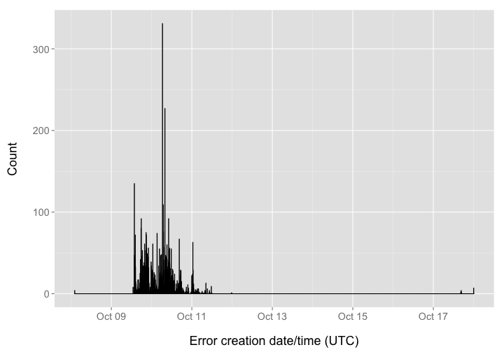
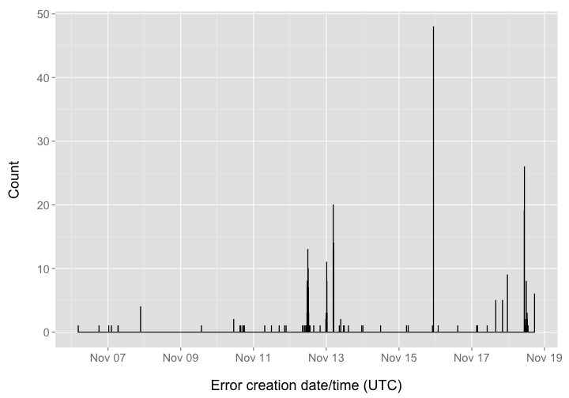
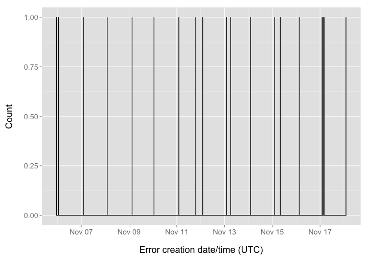

Crossref Report
========================================================


### Date 

Compiled on 2014-11-18 16:48:37

### Setup

> change directory to /data-quality/alerts


Install `alm` if not installed already, then load package


```r
# source functions
source("helper_fxns.R")

# install.packages('stringr')
# devtools::install_github("ropensci/alm", ref="dev")
library('stringr')
library('alm')
library('plyr')
library('dplyr')
library('tidyr')
library('assertthat')
library('ggplot2')
library('lubridate')
library('knitr')
```


```r
knitr::purl("alertssetup.Rmd")
source("alertssetup.R")
unlink("alertssetup.R")
```

### Set up variables


```r
url <- "http://det.labs.crossref.org/api/v4/alerts"
user <- getOption('almv4_crossref_user')
pwd <- getOption('almv4_crossref_pwd')
cr_v5_key <- getOption('crossrefalmkey')
```

### Get all data


```r
meta <- alm_alerts(url = url, user = user, pwd = pwd)$meta
res <- lapply(1:meta$total_pages, function(x) alm_alerts(page=x, url=url, user=user, pwd=pwd))
(resdf <- do.call(rbind, lapply(res, "[[", "data")) %>% 
   tbl_df %>% 
   select(id, level, class_name, article, status, source, create_date, target_url))
```

```
## Source: local data frame [8,162 x 8]
## 
##       id level              class_name
## 1  59612 ERROR       Net::HTTPConflict
## 2  59611  WARN Net::HTTPRequestTimeOut
## 3  59610  WARN Net::HTTPRequestTimeOut
## 4  59609  WARN Net::HTTPRequestTimeOut
## 5  59608  WARN Net::HTTPRequestTimeOut
## 6  59607  WARN Net::HTTPRequestTimeOut
## 7  59606  WARN Net::HTTPRequestTimeOut
## 8  59605  WARN Net::HTTPRequestTimeOut
## 9  59604  WARN Net::HTTPRequestTimeOut
## 10 59603  WARN Net::HTTPRequestTimeOut
## ..   ...   ...                     ...
## Variables not shown: article (chr), status (int), source (chr),
##   create_date (chr), target_url (chr)
```

### Types of errors


```r
resdf %>%
  group_by(class_name) %>%
  summarise(n = n()) %>%
  arrange(desc(n)) %>% 
  kable(format = "markdown")
```


|class_name                              |    n|
|:---------------------------------------|----:|
|ActiveRecord::RecordInvalid             | 6067|
|Net::HTTPServiceUnavailable             |  814|
|Net::HTTPRequestTimeOut                 |  421|
|Net::HTTPInternalServerError            |  384|
|Faraday::ClientError                    |  285|
|Net::HTTPUnauthorized                   |   79|
|Net::HTTPConflict                       |   59|
|FaradayMiddleware::RedirectLimitReached |   21|
|StandardError                           |   19|
|Faraday::ResourceNotFound               |   10|
|ArgumentError                           |    1|
|Net::HTTPBadRequest                     |    1|
|TooManyErrorsBySourceError              |    1|

### Alerts by source

By source alone

> NOTE: the NA's are not mistakes, but what is given as the source


```r
resdf %>%
  group_by(source) %>%
  summarise(n = n()) %>%
  ggplot(aes(reorder(source, n), n)) +
    geom_histogram(stat = "identity") + 
    coord_flip() +
    theme_grey(base_size = 20) +
    labs(x = "Source", y = "No. Articles")
```

 

source X alert class


```r
resdf %>%
  group_by(source, class_name) %>%
  summarise(n = n()) %>%
  ggplot(aes(reorder(class_name, n), n, fill=source)) +
    geom_histogram(stat = "identity") + 
    coord_flip() +
    theme_grey(base_size = 20) +
    labs(x = "Source", y = "No. Articles") +
    theme(legend.position = "top")
```

 

### Define functions


```r
library('rcrossref')

splitdoi <- function(x) strsplit(x, "/")[[1]][[1]]

match_publisher <- function(x, y){
  names(y[ sapply(y, function(z) x %in% z) ])
}

table_summary <- function(x){  
  rr <- x %>%
    group_by(publisher) %>%
    summarise(n = n()) %>%
    arrange(desc(n))
  kable(na.omit(rr[1:10,]), format = "markdown")
}

get_prefixes <- function(x){
  uniqpre <- na.omit(unique(x))
  cr_prefixes(uniqpre)$data %>%
    rowwise %>%
    mutate(prefix_ = strsplit(sub("http://id.crossref.org/prefix/", "", prefix), "/")[[1]][[1]]) %>%
    select(-member, -prefix)
}

hist_plot <- function(x, binwidth=400){
  x %>% mutate(create_date = ymd_hms(create_date)) %>%
    arrange(create_date) %>%
    ggplot(aes(create_date)) +
      geom_histogram(binwidth = binwidth, colour="black") +
      theme_grey(base_size = 18) +
      labs(x="\nError creation date/time (UTC)", y="Count\n")
}
```

The following is a simple summary/analysis of some alert classes. As the alert data can change through time, and whole categories can sometimes be missing from the dataset we're working with, each section looks for data of the particular alert class, and passes with a message if no data of that class is found. 

### ActiveRecord::RecordInvalid errors


```r
dat <- resdf %>%
  filter(class_name == "ActiveRecord::RecordInvalid") %>%
  select(id, level, class_name, article, status, source, create_date, target_url) %>%
  rowwise %>%
  mutate(prefix_ = strsplit(sub("http://api.crossref.org/works/", "", target_url), "/")[[1]][[1]])

pre_resdf <- get_prefixes(
  sapply(dat$target_url, function(x) strsplit(sub("http://api\\.crossref\\.org/works/", "", x), "/")[[1]][[1]], USE.NAMES = FALSE)
)

activerecord <- inner_join(dat, pre_resdf, "prefix_") %>%
  select(-article, -status, -source) %>%
  rename(prefix = prefix_, publisher = name)
table_summary(activerecord)
```


|publisher                                                                         |    n|
|:---------------------------------------------------------------------------------|----:|
|Elsevier BV                                                                       | 1050|
|Acta Physica Polonica B Editorial Office                                          |  732|
|The Feinstein Institute for Medical Research (North Shore LIJ Research Institute) |  356|
|Recht Fuer Deutschland GmbH                                                       |  335|
|FapUNIFESP (SciELO)                                                               |  319|
|Japan Rhinologic Society                                                          |  301|
|The Electrochemical Society of Japan                                              |  272|
|Turkish Journal of Fisheries and Aquatic Sciences                                 |  254|
|BMJ                                                                               |  216|
|Taiwanese Society of Biomedical Engineering                                       |  211|


```r
resdf %>%
  filter(class_name == "ActiveRecord::RecordInvalid") %>% 
  hist_plot()
```

 

### Net::HTTPBadGateway errors


```r
dat <- resdf %>% filter(class_name == "Net::HTTPBadGateway")
if(NROW(dat) == 0){ "no data" } else {
dat <- dat %>%
  rowwise %>%
  mutate(prefix = splitdoi(article)) %>%
  select(id, level, class_name, article, prefix, status, source, create_date, target_url)

pre_resdf <- get_prefixes(dat$prefix) %>% rename(prefix = prefix_)
net_httpbadgateway <- inner_join(dat, pre_resdf, "prefix") %>%
  rename(publisher = name)
table_summary(net_httpbadgateway)
}
```

```
## [1] "no data"
```

### Net::HTTPInternalServerError errors


```r
dat <- resdf %>% filter(class_name == "Net::HTTPInternalServerError")
if(NROW(dat) == 0){ "no data" } else {
dat <- dat %>%
  rowwise %>%
  mutate(prefix = splitdoi(article)) %>%
  select(id, level, class_name, article, prefix, status, source, create_date, target_url)

pre_resdf <- get_prefixes(dat$prefix) %>% rename(prefix = prefix_)
net_httpintserverr <- inner_join(dat, pre_resdf, "prefix") %>%
  rename(publisher = name)
table_summary(net_httpintserverr)
}
```


|publisher                         |  n|
|:---------------------------------|--:|
|Public Library of Science (PLoS)  | 86|
|Springer Science + Business Media | 55|
|Elsevier BV                       | 36|
|Hindawi Publishing Corporation    | 34|
|Medknow                           | 29|
|Wiley-Blackwell                   | 16|
|Oxford University Press (OUP)     |  9|
|MDPI AG                           |  8|
|Nature Publishing Group           |  8|
|American Chemical Society (ACS)   |  7|


```r
resdf %>% 
  filter(class_name == "Net::HTTPInternalServerError") %>%
  hist_plot(binwidth = 2000)
```

 

### Net::HTTPServiceUnavailable errors


```r
httpserveunavail <- resdf %>% filter(class_name == "Net::HTTPServiceUnavailable")
```

### Faraday::ClientError errors


```r
faradayclient <- resdf %>% filter(class_name == "Faraday::ClientError")
if(NROW(faradayclient) == 0){ "no data" } else {
faradayclient %>% hist_plot(binwidth = 200)
}
```

 

### Net::HTTPUnauthorized errors


```r
dat <- resdf %>%
  filter(class_name == "Net::HTTPUnauthorized") %>%
  rowwise %>%
  mutate(prefix = splitdoi(article)) %>%
  select(id, level, class_name, article, prefix, status, source, create_date, target_url)

pre_resdf <- get_prefixes(dat$prefix) %>% rename(prefix = prefix_)
net_httpunauthorized <- inner_join(dat, pre_resdf, "prefix") %>%
  rename(publisher = name)
table_summary(net_httpunauthorized)
```


|publisher               |  n|
|:-----------------------|--:|
|Nature Publishing Group | 79|

### Net::HTTPConflict errors


```r
net_httpconflict <- resdf %>% filter(class_name == "Net::HTTPConflict")
net_httpconflict %>% hist_plot(binwidth = 2000)
```

 

### FaradayMiddleware::RedirectLimitReached errors


```r
dat <- resdf %>% 
  filter(class_name == "FaradayMiddleware::RedirectLimitReached") %>%
  rowwise %>%
  mutate(prefix = splitdoi(article)) %>%
  select(id, level, class_name, article, prefix, create_date, target_url)

pre_resdf <- get_prefixes(dat$prefix) %>% rename(prefix = prefix_)
faraday_middleware <- inner_join(dat, pre_resdf, "prefix") %>%
  rename(publisher = name)
table_summary(faraday_middleware)
```


|publisher                          |  n|
|:----------------------------------|--:|
|Elsevier BV                        | 19|
|American Dairy Science Association |  2|

### Net::HTTPRequestTimeOut errors


```r
dat <- resdf %>% 
  filter(class_name == "Net::HTTPRequestTimeOut") %>%
  rowwise %>%
  mutate(prefix = splitdoi(article)) %>%
  select(id, level, class_name, article, prefix, create_date, target_url)

pre_resdf <- get_prefixes(dat$prefix) %>% rename(prefix = prefix_)
net_httprequesttimeout <- inner_join(dat, pre_resdf, "prefix") %>%
  rename(publisher = name)
table_summary(net_httprequesttimeout)
```


|publisher                                                  |   n|
|:----------------------------------------------------------|---:|
|Public Library of Science (PLoS)                           | 119|
|Springer Science + Business Media                          |  45|
|Hindawi Publishing Corporation                             |  37|
|Proceedings of the National Academy of Sciences            |  21|
|Elsevier BV                                                |  20|
|MDPI AG                                                    |  12|
|Medknow                                                    |  10|
|Wiley-Blackwell                                            |   6|
|Nature Publishing Group                                    |   5|
|American Association for the Advancement of Science (AAAS) |   3|


```r
net_httprequesttimeout %>% hist_plot()
```

 

### Faraday::ResourceNotFound errors


```r
faraday_resourcenotfound <- resdf %>% filter(class_name == "Faraday::ResourceNotFound")
```

### StandardError errors


```r
standarder <- resdf %>% filter(class_name == "StandardError")
standarder %>% hist_plot()
```

 

### Write files out


```r
write_csv <- function(x){
  if(NROW( get(x) ) != 0){
    write.csv(get(x), file=sprintf("crossref_files/%s_error_%s.csv", x, Sys.Date()),
              row.names=FALSE)
  }
}

write_csv('activerecord')
write_csv('net_httpbadgateway')
```

```
## Error in get(x): object 'net_httpbadgateway' not found
```

```r
write_csv('httpserveunavail')
write_csv('faradayclient')
write_csv('net_httpunauthorized')
write_csv('net_httpconflict')
write_csv('faraday_middleware')
write_csv('net_httprequesttimeout')
write_csv('faraday_resourcenotfound')
write_csv('net_httpinternalservererror')
```

```
## Error in get(x): object 'net_httpinternalservererror' not found
```

```r
write_csv('net_httpintserverr')
```
