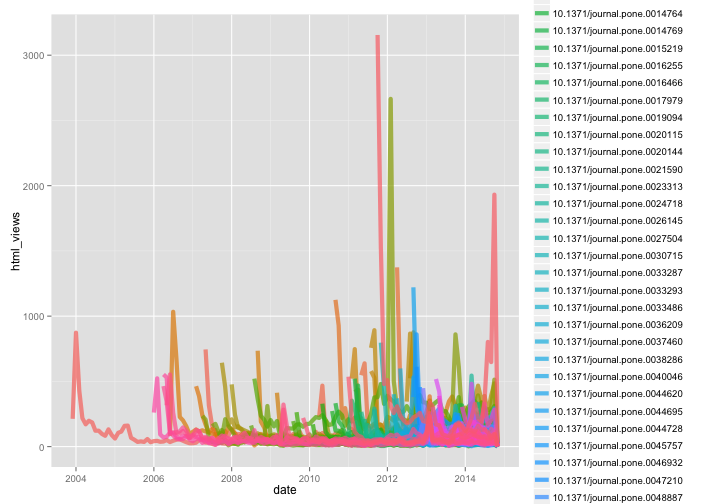
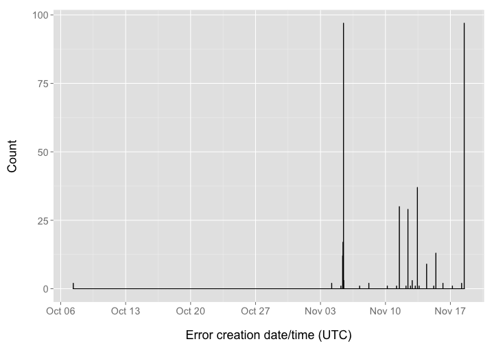
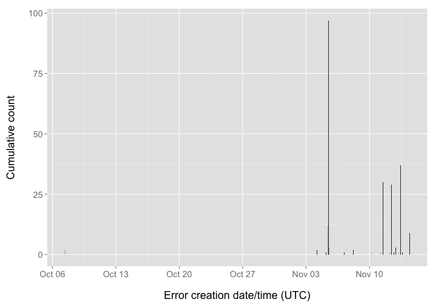

EventCountDecreasingError
========================================================


### Date 

Compiled on 2014-11-03 09:52:36

### Setup

> change directory to /data-quality/alerts


Install `alm` if not installed already, then load package


```r
# source functions
source("helper_fxns.R")

# install.packages('stringr')
# devtools::install_github("ropensci/alm", ref="dev")
library('stringr')
library('alm')
library('plyr')
library('dplyr')
library('tidyr')
library('assertthat')
library('ggplot2')
library('lubridate')
library('knitr')
```


```r
knitr::purl("alertssetup.Rmd")
source("alertssetup.R")
unlink("alertssetup.R")
```

### Get data


```r
(res <- alerts_by_class(class_name='EventCountDecreasingError', limit=10000L))
```

```
## Source: local data frame [9,970 x 8]
## 
##          id                      article  val from to          create_date
## 1  13155454 10.1371/journal.pbio.0040088 1411 1411  0 2014-11-01T08:05:52Z
## 2  13156302 10.1371/journal.pbio.0050254  510  510  0 2014-11-01T08:05:55Z
## 3  13153432 10.1371/journal.pbio.0020312  508  508  0 2014-11-01T08:05:45Z
## 4  13149572 10.1371/journal.pgen.0030115  419  419  0 2014-11-01T08:05:32Z
## 5  13153476 10.1371/journal.pone.0009490  377  377  0 2014-11-01T08:05:45Z
## 6  13157962 10.1371/journal.pbio.1001046  340  340  0 2014-11-01T08:06:01Z
## 7  13155836 10.1371/journal.pbio.0050038  315  315  0 2014-11-01T08:05:54Z
## 8  13154996 10.1371/journal.pbio.0030422  312  312  0 2014-11-01T08:05:50Z
## 9  13159450 10.1371/journal.pcbi.0030017  305  305  0 2014-11-01T08:06:07Z
## 10 13154536 10.1371/journal.pbio.0030283  301  301  0 2014-11-01T08:05:49Z
## ..      ...                          ...  ...  ... ..                  ...
## Variables not shown: source (chr), class (chr)
```

Remove Mendeley data


```r
res <- res %>% filter(!source == "mendeley")
```

Clean out PLOS Currents urls


```r
res <- res %>% filter(grepl('journal', article))
res <- res %>% 
  rename(doi = article, alert_class = class, alert_source = source, alert_create_date = create_date, alert_id = id, alert_val = val, alert_from = from, alert_to = to)
```

There can be a lot of data from Crossref, so let's take the top 50 from that source


```r
cr_top50 <- res %>%
  filter(alert_source == "crossref") %>%
  arrange(desc(alert_val)) %>%
  data.frame %>%
  .[1:50,]
restop <- tbl_df(rbind(cr_top50, res %>% filter(alert_source != "crossref")))
```

Get ALM events data and merge alerts data to it


```r
# altmetrics totals data
idsdata <- alm_ids(restop$doi)
almdat <- function(x, y){
  dat <- x$total
  names(dat) <- x$.id
  data.frame(doi=y, t(data.frame(dat, stringsAsFactors = FALSE)), stringsAsFactors = FALSE)
}
idsdata2 <- rbind_all(Map(almdat, idsdata$data, names(idsdata$data)))

# events data
events <- lapply(restop$doi, alm_events)
names(events) <- restop$doi
# limit events to certain sources of data
sources <- c("counter", unique(res$alert_source))
eventsdata <- lapply(events, function(x) x[names(x) %in% sources])

foo <- function(x, y){
  tmp <- x$counter$events
  z <- if(NROW(tmp) == 0) data.frame(year=NA, month=NA, pdf_views=NA, html_views=NA, xml_views=NA) else tmp
  data.frame(doi=y, z, stringsAsFactors = FALSE)
}
events_counter <- Map(foo, eventsdata, names(eventsdata))
eventsdf <- tbl_df(rbind_all(events_counter))
alldf <- inner_join(x=eventsdf, y=res)
alldf <- inner_join(x=alldf, y=idsdata2)
alldf <- alldf %>% 
    mutate(date = as.Date(sprintf('%s-%s-01', year, month)))
alldf$alert_create_date <- as.Date(ymd_hms(alldf$alert_create_date))
alldf
```

```
## Source: local data frame [11,104 x 41]
## 
##                             doi year month pdf_views html_views xml_views
## 1  10.1371/journal.pbio.0040088 2006     3       224        365         1
## 2  10.1371/journal.pbio.0040088 2006     4       209        339         0
## 3  10.1371/journal.pbio.0040088 2006     5       991       1290         2
## 4  10.1371/journal.pbio.0040088 2006     6       392        601        11
## 5  10.1371/journal.pbio.0040088 2006     7       208        293         4
## 6  10.1371/journal.pbio.0040088 2006     8       191        242         5
## 7  10.1371/journal.pbio.0040088 2006     9       117        204         5
## 8  10.1371/journal.pbio.0040088 2006    10       146        248         0
## 9  10.1371/journal.pbio.0040088 2006    11       126        254         2
## 10 10.1371/journal.pbio.0040088 2006    12       107        203         0
## ..                          ...  ...   ...       ...        ...       ...
## Variables not shown: alert_id (int), alert_val (dbl), alert_from (dbl),
##   alert_to (dbl), alert_create_date (date), alert_source (chr),
##   alert_class (chr), citeulike (int), crossref (int), nature (int), pubmed
##   (int), scopus (int), counter (int), researchblogging (int), wos (int),
##   pmc (int), facebook (int), mendeley (int), twitter (int), wikipedia
##   (int), scienceseeker (int), relativemetric (int), f1000 (int), figshare
##   (int), pmceurope (int), pmceuropedata (int), openedition (int),
##   wordpress (int), reddit (int), datacite (int), copernicus (int),
##   articlecoverage (int), articlecoveragecurated (int), plos_comments
##   (int), date (date)
```

WOS data


```r
alldf %>%
  filter(alert_source == "wos") %>%
  ggplot(aes(date, html_views, color=doi)) +
    geom_line(size = 2, alpha = 0.7)
```

 

pmceurope data


```r
alldf %>%
  filter(alert_source == "pmceurope") %>%
  ggplot(aes(date, html_views, color=doi)) +
    geom_line(size = 2, alpha = 0.7)
```

 

pmceuropedata data


```r
alldf %>%
  filter(alert_source == "pmceuropedata") %>%
  ggplot(aes(date, html_views, color=doi)) +
    geom_line(size = 2, alpha = 0.7)
```

 

pubmed data


```r
alldf %>%
  filter(alert_source == "pubmed") %>%
  ggplot(aes(date, html_views, color=doi)) +
    geom_line(size = 2, alpha = 0.7)
```

 

citeulike data


```r
alldf %>%
  filter(alert_source == "citeulike") %>%
  ggplot(aes(date, html_views, color=doi)) +
    geom_line(size = 2, alpha = 0.7)
```

 
