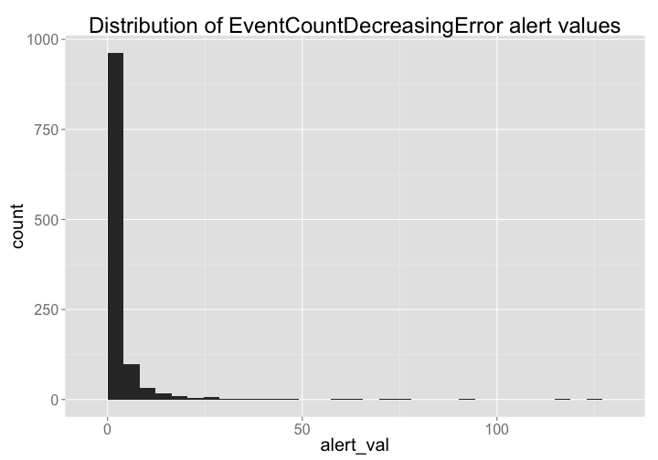

## Exploring Mendeley data

### Setup

> change directory to data-quality/alerts/


Install `alm` if not installed already, then load package


```r
# source helper fxns
source("helper_fxns.R")

# install.packages('stringr')
# devtools::install_github("ropensci/alm", ref="dev")
library('stringr')
library('alm')
library('plyr')
library('dplyr')
library('tidyr')
library('assertthat')
library('ggplot2')
library('lubridate')
```

### Get data


```r
(res <- alerts_by_class(class_name='EventCountDecreasingError', limit=5000L))
```

```
## Source: local data frame [1,156 x 8]
## 
##          id                      article val from to          create_date
## 1  11312941 10.1371/journal.pone.0004678 124  219 95 2014-09-27T08:03:47Z
## 2  11312043 10.1371/journal.pcbi.0030114 117  143 26 2014-09-27T08:03:40Z
## 3  11312871 10.1371/journal.pone.0009979  94  102  8 2014-09-27T08:03:46Z
## 4  11311903 10.1371/journal.ppat.1002464  77  128 51 2014-09-27T08:03:39Z
## 5  11313039 10.1371/journal.pcbi.1002886  75  128 53 2014-09-27T08:03:47Z
## 6  11312481 10.1371/journal.pone.0029348  70  120 50 2014-09-27T08:03:43Z
## 7  11313185 10.1371/journal.pcbi.0020161  65  124 59 2014-09-27T08:03:49Z
## 8  11312807 10.1371/journal.pone.0007824  65  126 61 2014-09-27T08:03:46Z
## 9  11373839 10.1371/journal.pcbi.1003054  64   93 29 2014-09-30T08:00:38Z
## 10 11312247 10.1371/journal.pone.0025970  61   95 34 2014-09-27T08:03:42Z
## ..      ...                          ... ...  ... ..                  ...
## Variables not shown: source (chr), class (chr)
```

#### Data cleaning

> remove annotation DOIs - NOTE: if you want these, don't run this next few lines of code & remove dois that don't have `journal.`


```r
annot <- res %>% filter(grepl('annotation', article)) %>% select(article)
(res <- res %>% filter(!article %in% annot$article))
```

```
## Source: local data frame [1,155 x 8]
## 
##          id                      article val from to          create_date
## 1  11312941 10.1371/journal.pone.0004678 124  219 95 2014-09-27T08:03:47Z
## 2  11312043 10.1371/journal.pcbi.0030114 117  143 26 2014-09-27T08:03:40Z
## 3  11312871 10.1371/journal.pone.0009979  94  102  8 2014-09-27T08:03:46Z
## 4  11311903 10.1371/journal.ppat.1002464  77  128 51 2014-09-27T08:03:39Z
## 5  11313039 10.1371/journal.pcbi.1002886  75  128 53 2014-09-27T08:03:47Z
## 6  11312481 10.1371/journal.pone.0029348  70  120 50 2014-09-27T08:03:43Z
## 7  11313185 10.1371/journal.pcbi.0020161  65  124 59 2014-09-27T08:03:49Z
## 8  11312807 10.1371/journal.pone.0007824  65  126 61 2014-09-27T08:03:46Z
## 9  11373839 10.1371/journal.pcbi.1003054  64   93 29 2014-09-30T08:00:38Z
## 10 11312247 10.1371/journal.pone.0025970  61   95 34 2014-09-27T08:03:42Z
## ..      ...                          ... ...  ... ..                  ...
## Variables not shown: source (chr), class (chr)
```

```r
(res <- res %>% filter(grepl('journal', article)))
```

```
## Source: local data frame [1,151 x 8]
## 
##          id                      article val from to          create_date
## 1  11312941 10.1371/journal.pone.0004678 124  219 95 2014-09-27T08:03:47Z
## 2  11312043 10.1371/journal.pcbi.0030114 117  143 26 2014-09-27T08:03:40Z
## 3  11312871 10.1371/journal.pone.0009979  94  102  8 2014-09-27T08:03:46Z
## 4  11311903 10.1371/journal.ppat.1002464  77  128 51 2014-09-27T08:03:39Z
## 5  11313039 10.1371/journal.pcbi.1002886  75  128 53 2014-09-27T08:03:47Z
## 6  11312481 10.1371/journal.pone.0029348  70  120 50 2014-09-27T08:03:43Z
## 7  11313185 10.1371/journal.pcbi.0020161  65  124 59 2014-09-27T08:03:49Z
## 8  11312807 10.1371/journal.pone.0007824  65  126 61 2014-09-27T08:03:46Z
## 9  11373839 10.1371/journal.pcbi.1003054  64   93 29 2014-09-30T08:00:38Z
## 10 11312247 10.1371/journal.pone.0025970  61   95 34 2014-09-27T08:03:42Z
## ..      ...                          ... ...  ... ..                  ...
## Variables not shown: source (chr), class (chr)
```

```r
res <- res %>% 
  rename(doi = article, alert_class = class, alert_source = source, alert_create_date = create_date, alert_id = id, alert_val = val, alert_from = from, alert_to = to)
res
```

```
## Source: local data frame [1,151 x 8]
## 
##    alert_id                          doi alert_val alert_from alert_to
## 1  11312941 10.1371/journal.pone.0004678       124        219       95
## 2  11312043 10.1371/journal.pcbi.0030114       117        143       26
## 3  11312871 10.1371/journal.pone.0009979        94        102        8
## 4  11311903 10.1371/journal.ppat.1002464        77        128       51
## 5  11313039 10.1371/journal.pcbi.1002886        75        128       53
## 6  11312481 10.1371/journal.pone.0029348        70        120       50
## 7  11313185 10.1371/journal.pcbi.0020161        65        124       59
## 8  11312807 10.1371/journal.pone.0007824        65        126       61
## 9  11373839 10.1371/journal.pcbi.1003054        64         93       29
## 10 11312247 10.1371/journal.pone.0025970        61         95       34
## ..      ...                          ...       ...        ...      ...
## Variables not shown: alert_create_date (chr), alert_source (chr),
##   alert_class (chr)
```

### alm data


```r
dat <- alm_ids(res$doi, source = c("mendeley","counter"), info = "detail")
```

Clean alm data


```r
(info <- rbind_all(lapply(dat$data, "[[", "info")))
```

```
## Source: local data frame [1,151 x 8]
## 
##                             doi
## 1  10.1371/journal.pone.0073773
## 2  10.1371/journal.pone.0065764
## 3  10.1371/journal.pone.0065772
## 4  10.1371/journal.pcbi.1003054
## 5  10.1371/journal.pone.0064534
## 6  10.1371/journal.pone.0062111
## 7  10.1371/journal.pone.0060968
## 8  10.1371/journal.pcbi.1002886
## 9  10.1371/journal.pone.0057300
## 10 10.1371/journal.pone.0041282
## ..                          ...
## Variables not shown: title (chr), canonical_url (chr), pmid (chr), pmcid
##   (chr), mendeley_uuid (chr), update_date (chr), issued (chr)
```

```r
totals <- ldply(dat$data, function(x){ 
  x <- x$totals[,-1]
  x$readers[1] <- x$readers[2]
  x[-2,]
})
(totals_df <- tbl_df(totals))
```

```
## Source: local data frame [1,151 x 7]
## 
##                             .id  pdf  html readers comments likes total
## 1  10.1371/journal.pone.0073773  908  4428       0       NA    NA  5364
## 2  10.1371/journal.pone.0065764  521  5541       1       NA    NA  6091
## 3  10.1371/journal.pone.0065772  830  5657      22       NA    NA  6524
## 4  10.1371/journal.pcbi.1003054 1523  8203      29       NA    NA  9771
## 5  10.1371/journal.pone.0064534  209  1048       1       NA    NA  1274
## 6  10.1371/journal.pone.0062111 2736 17572     177       NA    NA 20361
## 7  10.1371/journal.pone.0060968  458  1500       8       NA    NA  1979
## 8  10.1371/journal.pcbi.1002886 1166  8542      53       NA    NA  9760
## 9  10.1371/journal.pone.0057300  433  2981       0       NA    NA  3433
## 10 10.1371/journal.pone.0041282  433  1916      22       NA    NA  2369
## ..                          ...  ...   ...     ...      ...   ...   ...
```

```r
names(totals_df)[[1]] <- "doi"
totals_df <- totals_df %>%
  select(doi, pdf, html, readers, total)
```

### events data


```r
events <- alm_events(res$doi, source = "mendeley")
```

Clean events data


```r
# remove records that have no data
events <- events[ sapply(events, function(z) is.list(z[[1]])) ]
# pull out events_url data
(events_urls <- tbl_df(ldply(lapply(events, function(z) z$mendeley$events_url))))
```

```
## Source: local data frame [1,112 x 2]
## 
##                             .id
## 1  10.1371/journal.pone.0065764
## 2  10.1371/journal.pone.0065772
## 3  10.1371/journal.pcbi.1003054
## 4  10.1371/journal.pone.0064534
## 5  10.1371/journal.pone.0062111
## 6  10.1371/journal.pone.0060968
## 7  10.1371/journal.pcbi.1002886
## 8  10.1371/journal.pone.0041282
## 9  10.1371/journal.ppat.1002742
## 10 10.1371/journal.pone.0032960
## ..                          ...
## Variables not shown: V1 (chr)
```

```r
names(events_urls)[1] <- "doi"
# pull out events data
events_d_tmp <- lapply(events, function(z) z$mendeley$events)
(events_data <- rbind_all_named(events_d_tmp))
```

```
## Source: local data frame [8,948 x 4]
## 
##           .id                name value                          doi
## 1     readers             readers     1 10.1371/journal.pone.0065764
## 2  discipline           Education   100 10.1371/journal.pone.0065764
## 3      status    Doctoral Student   100 10.1371/journal.pone.0065764
## 4     readers             readers    22 10.1371/journal.pone.0065772
## 5  discipline            Medicine    50 10.1371/journal.pone.0065772
## 6  discipline     Social Sciences    14 10.1371/journal.pone.0065772
## 7  discipline Biological Sciences     9 10.1371/journal.pone.0065772
## 8     country       United States     5 10.1371/journal.pone.0065772
## 9      status    Student (Master)    32 10.1371/journal.pone.0065772
## 10     status       Ph.D. Student    23 10.1371/journal.pone.0065772
## ..        ...                 ...   ...                          ...
```

```r
names(events_data)[1] <- "class"
events_data <- events_data %>%
  rename(mendeley_class = class, mendeley_name = name, mendeley_value = value)
```

### Combine data


```r
(alldat <- tbl_df(join_all(list(info, totals_df, events_data, res), by = "doi")))
```

```
## Source: local data frame [9,211 x 22]
## 
##                             doi
## 1  10.1371/journal.pone.0073773
## 2  10.1371/journal.pone.0065764
## 3  10.1371/journal.pone.0065764
## 4  10.1371/journal.pone.0065764
## 5  10.1371/journal.pone.0065772
## 6  10.1371/journal.pone.0065772
## 7  10.1371/journal.pone.0065772
## 8  10.1371/journal.pone.0065772
## 9  10.1371/journal.pone.0065772
## 10 10.1371/journal.pone.0065772
## ..                          ...
## Variables not shown: title (chr), canonical_url (chr), pmid (chr), pmcid
##   (chr), mendeley_uuid (chr), update_date (chr), issued (chr), pdf (dbl),
##   html (dbl), readers (dbl), total (dbl), mendeley_class (chr),
##   mendeley_name (chr), mendeley_value (dbl), alert_id (dbl), alert_val
##   (dbl), alert_from (dbl), alert_to (dbl), alert_create_date (chr),
##   alert_source (chr), alert_class (chr)
```

### Visualize

Histogram of alert values


```r
library('ggplot2')
alldat %>%
  select(doi, matches("alert")) %>%
  unique %>%
  ggplot(aes(alert_val)) + 
    geom_histogram() + 
    theme_grey(base_size = 20) +
    ggtitle("Distribution of EventCountDecreasingError alert values")
```

```
## stat_bin: binwidth defaulted to range/30. Use 'binwidth = x' to adjust this.
```

 

```r
# ggsave("mendeley_histogram.png")
```

Plot of alert against X


```r
alldat %>%
  select(doi, alert_from, alert_to) %>%
  unique %>% # get unique dois
  gather(metric, value, -doi) %>% # stack data
  filter(value < 1000) %>% # remove outliers
  ggplot(aes(doi, value, color=metric)) +
    geom_point(size=2, alpha=0.6) +
    scale_color_manual(values = c('#F9AA8B','#C3E1F1')) +
    theme_grey(base_size = 18) +
    theme(axis.ticks.x = element_blank(), 
          axis.text.x = element_blank(),
          legend.position = "top") +
    guides(color = guide_legend(title = ""))
```

 

```r
# ggsave("mendeley_points.png")
```

### Write report


```r
write.csv(alldat, file=sprintf("mendeley_report_%s.csv", Sys.Date()), row.names=FALSE)
```
