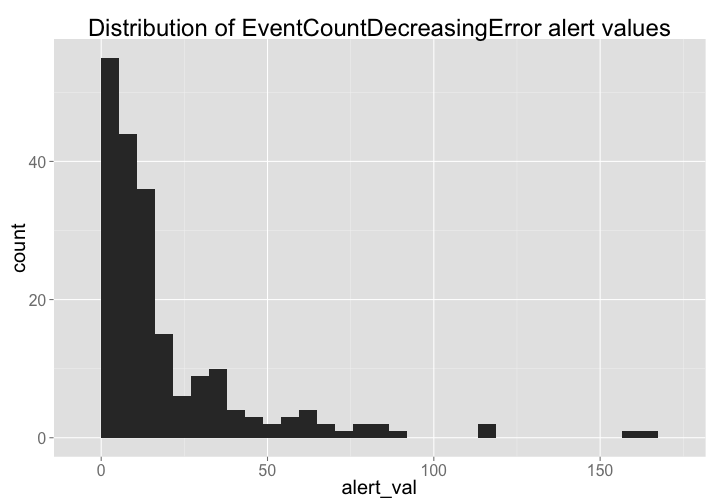
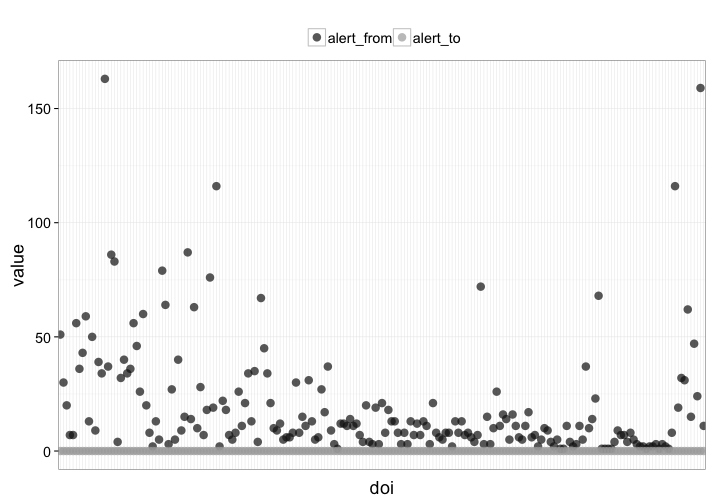

Exploring Mendeley data
========================================================


### Date 

Compiled on 2014-11-02 16:56:45

### Setup

> change directory to data-quality/alerts/


Install `alm` if not installed already, then load package


```r
# source functions
source("helper_fxns.R")

# install.packages('stringr')
# devtools::install_github("ropensci/alm", ref="dev")
library('stringr')
library('alm')
library('plyr')
library('dplyr')
library('tidyr')
library('assertthat')
library('ggplot2')
library('lubridate')
library('knitr')
```


```r
knitr::purl("alertssetup.Rmd")
source("alertssetup.R")
unlink("alertssetup.R")
```

### Get data


```r
# (res <- alerts_by_class(class_name='EventCountDecreasingError', limit=10000L))
pgs <- alm_alerts(source = "mendeley")$meta$total_pages
res <- lapply(1:pgs, function(x) alm_alerts(source = "mendeley", page = x)$data)
(res <- tbl_df(do.call(rbind.fill, res)))
```

```
## Source: local data frame [212 x 11]
## 
##          id level                class_name
## 1  13111438 ERROR     SourceNotUpdatedError
## 2  13104774 ERROR     SourceNotUpdatedError
## 3  12891686  WARN EventCountDecreasingError
## 4  12891684  WARN EventCountDecreasingError
## 5  12891682  WARN EventCountDecreasingError
## 6  12891680  WARN EventCountDecreasingError
## 7  12891678  WARN EventCountDecreasingError
## 8  12891676  WARN EventCountDecreasingError
## 9  12891674  WARN EventCountDecreasingError
## 10 12891672  WARN EventCountDecreasingError
## ..      ...   ...                       ...
## Variables not shown: message (chr), status (int), hostname (chr),
##   target_url (chr), source (chr), article (chr), unresolved (lgl),
##   create_date (chr)
```

#### Data cleaning

> remove annotation DOIs - NOTE: if you want these, don't run this next few lines of code & remove dois that don't have `journal.`


```r
# res <- res %>% filter(source == "mendeley") # mendeley only
# if(NROW(res) == 0) stop("No Mendeley data")
```

Continue, if there is Mendeley data


```r
annot <- res %>% filter(grepl('annotation', article)) %>% select(article) 
res <- res %>% filter(!article %in% annot$article)
res <- res %>% filter(grepl('journal', article))
res <- res %>%
  alerts_parse %>% 
  tbl_df %>%
  rename(doi = article, alert_source = source, alert_create_date = create_date, alert_id = id, alert_val = val, alert_from = from, alert_to = to)
```

### alm data


```r
dat <- alm_ids(res$doi, info = "detail")
```

Clean alm data


```r
info <- rbind_all(lapply(dat$data, "[[", "info"))
totals <- ldply(dat$data, function(x){ 
  x <- x$totals[,-1]
  x$readers[1] <- x$readers[2]
  x[-2,]
})
totals_df <- tbl_df(totals)
names(totals_df)[[1]] <- "doi"
totals_df <- totals_df %>%
  select(doi, pdf, html, readers, total)
```

### events data


```r
events <- alm_events(res$doi, source = "mendeley")
```

Clean events data


```r
# remove records that have no data
events2 <- Filter(function(x) length(x) != 0, events)
# pull out events_url data
(events_urls <- tbl_df(ldply(lapply(events2, function(z) z$mendeley$events_url))))
```

```
## Source: local data frame [7 x 2]
## 
##                            .id
## 1 10.1371/journal.pone.0109895
## 2 10.1371/journal.pone.0059957
## 3 10.1371/journal.pone.0045705
## 4 10.1371/journal.pone.0026896
## 5 10.1371/journal.pcbi.1001110
## 6 10.1371/journal.pone.0001073
## 7 10.1371/journal.pone.0000831
## Variables not shown: V1 (chr)
```

```r
names(events_urls)[1] <- "doi"
# pull out events data
events_d_tmp <- lapply(events2, function(z) z$mendeley$events)
events_data <- rbind_all_named(events_d_tmp)
names(events_data)[1] <- "class"
events_data <- events_data %>%
  rename(mendeley_class = class, mendeley_name = name, mendeley_value = value)
```

### Combine data


```r
(alldat <- tbl_df(join_all(list(info, totals_df, events_data, res), by = "doi")))
```

```
## Source: local data frame [6,614 x 28]
## 
##                             doi
## 1  10.1371/journal.pcbi.1003759
## 2  10.1371/journal.pcbi.1003759
## 3  10.1371/journal.pcbi.1003759
## 4  10.1371/journal.pcbi.1003759
## 5  10.1371/journal.pcbi.1003759
## 6  10.1371/journal.pcbi.1003759
## 7  10.1371/journal.pcbi.1003759
## 8  10.1371/journal.pcbi.1003759
## 9  10.1371/journal.pcbi.1003759
## 10 10.1371/journal.pcbi.1003759
## ..                          ...
## Variables not shown: title (chr), canonical_url (chr), pmid (chr), pmcid
##   (chr), mendeley_uuid (chr), update_date (chr), issued (chr), pdf (int),
##   html (int), readers (int), total (int), mendeley_class (chr),
##   mendeley_name (chr), mendeley_value (int), alert_id (int), level (chr),
##   class_name (chr), message (chr), status (int), hostname (chr),
##   target_url (chr), alert_source (chr), unresolved (lgl),
##   alert_create_date (chr), alert_from (dbl), alert_to (dbl), alert_val
##   (dbl)
```

### Visualize

Histogram of alert values


```r
library('ggplot2')
alldat %>%
  select(doi, matches("alert")) %>%
  unique %>%
  ggplot(aes(alert_val)) + 
    geom_histogram() + 
    theme_grey(base_size = 20) +
    ggtitle("Distribution of EventCountDecreasingError alert values")
```

```
## stat_bin: binwidth defaulted to range/30. Use 'binwidth = x' to adjust this.
```

 

```r
# ggsave("mendeley_histogram.png")
```

Plot of alert against X


```r
alldat %>%
  select(doi, alert_from, alert_to) %>%
  unique %>% # get unique dois
  gather(metric, value, -doi) %>% # stack data
  filter(value < 1000) %>% # remove outliers
  ggplot(aes(doi, value, color=metric)) +
    geom_point(size=4, alpha=0.7) +
    scale_color_manual(values = c('#141414','#AAAAAA')) +
    theme_bw(base_size = 18) +
    theme(axis.ticks.x = element_blank(), 
          axis.text.x = element_blank(),
          legend.position = "top") +
    guides(color = guide_legend(title = ""))
```

 

```r
# ggsave("mendeley_points.png")
```

### Write report


```r
write.csv(alldat, file=sprintf("mendeley_files/mendeley_report_%s.csv", Sys.Date()), row.names=FALSE)
```
