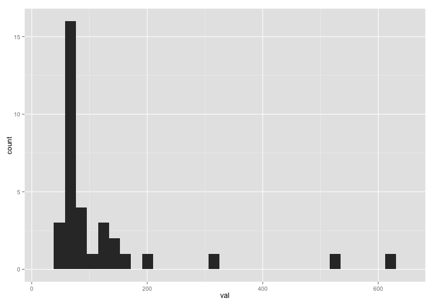
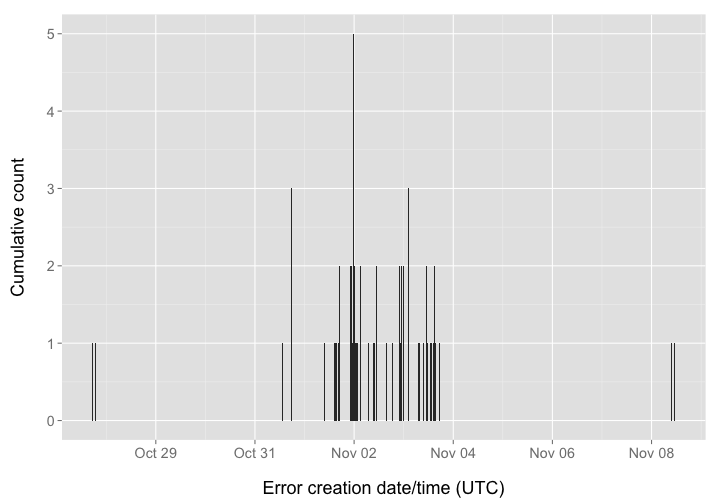

Workflow for detecting and exploring just outliers
========================================================


### Date 

Compiled on 2014-10-21 19:33:48

### Setup

> change directory to /data-quality/alerts/


Install `alm` if not installed already, then load package


```r
# source functions
source("helper_fxns.R")

# install.packages('stringr')
# devtools::install_github("ropensci/alm", ref="dev")
library('stringr')
library('alm')
library('plyr')
library('dplyr')
library('tidyr')
library('assertthat')
library('ggplot2')
library('lubridate')
library('knitr')
```


### Get alerts data by alert class

#### get data cached for three impt alert classes


```r
classes <- c('HtmlRatioTooHighError','EventCountDecreasingError','EventCountIncreasingTooFastError')
res <- lapply(classes, alerts_by_class, limit=1000)
(resdf <- tbl_df(rbind_all(res)))
```


#### By class, change class_name var at top


```r
class_name = 'HtmlRatioTooHighError'
```

Get data


```r
(res <- alerts_by_class(class_name, limit=2000))
```

```
## Source: local data frame [219 x 6]
## 
##          id                      article     val          create_date
## 1  12262584 10.1371/journal.pone.0084669 1636.00 2014-10-18T08:33:04Z
## 2  12067540 10.1371/journal.pctr.0010015 1251.00 2014-10-14T08:10:25Z
## 3  12262590 10.1371/journal.pbio.1000169  634.00 2014-10-18T08:33:04Z
## 4  12312904 10.1371/journal.pntd.0001985  619.00 2014-10-19T08:37:46Z
## 5  12262576 10.1371/journal.pntd.0001769  612.00 2014-10-18T08:33:04Z
## 6  12312930 10.1371/journal.pone.0043593  586.00 2014-10-19T08:37:48Z
## 7  12354474 10.1371/journal.ppat.0020118  542.00 2014-10-20T08:07:07Z
## 8  12067310 10.1371/journal.pone.0046740  512.22 2014-10-14T08:10:24Z
## 9  12412654 10.1371/journal.pmed.1000092  507.00 2014-10-21T08:07:05Z
## 10 12067374 10.1371/journal.pbio.0030339  435.40 2014-10-14T08:10:25Z
## ..      ...                          ...     ...                  ...
## Variables not shown: source (chr), class (chr)
```

```r
# remove bad data
res <- res %>%
  filter(!is.na(article))
```

Extract top N articles, get DOIs


```r
num_get <- 10
toinspect <- res[1:num_get,] %>% select(-class)
(dois <- toinspect$article)
```

```
##  [1] "10.1371/journal.pone.0084669" "10.1371/journal.pctr.0010015"
##  [3] "10.1371/journal.pbio.1000169" "10.1371/journal.pntd.0001985"
##  [5] "10.1371/journal.pntd.0001769" "10.1371/journal.pone.0043593"
##  [7] "10.1371/journal.ppat.0020118" "10.1371/journal.pone.0046740"
##  [9] "10.1371/journal.pmed.1000092" "10.1371/journal.pbio.0030339"
```

Browse to an article


```r
browseURL(sprintf("http://alm.plos.org/articles/info:doi/%s", res$article[2]))
```


Get ALM events data and merge alerts data to it


```r
alldf <- add_events_data(toinspect, dois)
```

```
## Joining by: "article"
```

ggplot elements to reuse


```r
gg <- function(){
  list(geom_line(size = 2, alpha = 0.6),
       geom_vline(aes(xintercept=as.numeric(create_date)), linetype="longdash"),
       ggtitle("HtmlRatioTooHighError - Top ten highest HTML/PDF ratio articles\n"),
       facet_wrap(~ article, ncol = 2, scales = "free"),
       labs(y="", x=""),
       theme_grey(base_size = 14))
}
```

The distribution of html/pdf ratios


```r
res %>%
  ggplot(aes(x=val)) + geom_histogram()
```

```
## stat_bin: binwidth defaulted to range/30. Use 'binwidth = x' to adjust this.
```

 


Plot html and pdf views, just top 10


```r
alldf %>%
  select(-year, -month, -id, -val, -source, -xml_views, -ratio) %>%
  gather(metric, value, -article, -date, -create_date) %>% 
  ggplot(aes(date, value, color=metric)) + gg()
```

 

The HTML/PDF ratio, just top 10


```r
alldf %>%
  select(-year, -month, -id, -val, -source, -xml_views, -html_views, -pdf_views) %>%
  ggplot(aes(date, ratio)) + gg()
```

 

All ratio lines together


```r
(alldf_alldois <- add_events_data(res, res$article))
```

```
## Joining by: "article"
```

```
## Source: local data frame [4,134 x 13]
## 
##                         article year month pdf_views html_views xml_views
## 1  10.1371/journal.pcbi.1003952 2014    10        10        688         2
## 2  10.1371/journal.ppat.1004494 2014    10         8       1099         4
## 3  10.1371/journal.pntd.0003293 2014    10        11       1546         5
## 4  10.1371/journal.pntd.0003277 2014     9         4         84         5
## 5  10.1371/journal.pntd.0003277 2014    10         7       1886         5
## 6  10.1371/journal.pntd.0003196 2014     9        39        436         6
## 7  10.1371/journal.pntd.0003196 2014    10        13       2205         3
## 8  10.1371/journal.pntd.0003264 2014     9        11        232         9
## 9  10.1371/journal.pntd.0003264 2014    10         4       1813         2
## 10 10.1371/journal.pntd.0003137 2014     9        30        502        13
## ..                          ...  ...   ...       ...        ...       ...
## Variables not shown: id (int), val (dbl), create_date (date), source
##   (chr), class (chr), date (date), ratio (dbl)
```

```r
alldf_alldois %>%
  select(article, date, create_date, ratio) %>%
  ggplot(aes(date, log10(ratio), group=article)) + 
    geom_line() +
    labs(y="", x="") +
    theme_grey(base_size = 14)
```

 

Dig in to particular DOIs. This is rather free-form, depends on the metric of interest.


```r
doi1 <- '10.1371/journal.pbio.0040066'
alm_events(doi1, source = "facebook")
alm_ids(doi1, info = "detail")
```

Are the high value offender DOIs associated with other alm metrics, like social media metrics


```r
dat <- alm_ids(res$article, source = c("facebook","twitter","mendeley","reddit","scopus","wikipedia"))
datdf <- rbind_all(dat$data)
datdf$article <- rep(res$article, each = 6)
datdf <- inner_join(datdf, res %>% filter(article %in% res$article) %>% select(article, val) )

datdf %>% 
  ggplot(aes(x=val, y=total)) + 
    geom_point(aes(size=2)) +
    facet_wrap(~ .id, scales='free') +
    labs(y="", x="") +
    theme_grey(base_size = 18) +
    theme(legend.position="none")
```


Detect spikes/patterns in signals through time


```r
'not done yet...'
```

> based on the above work, identify which articles are deserving of further inspection/flagging - perhaps need to look at log files for IP addresses, etc.
