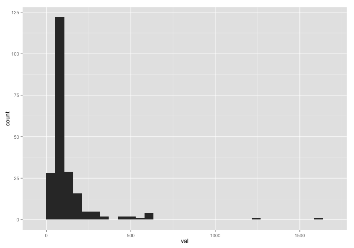
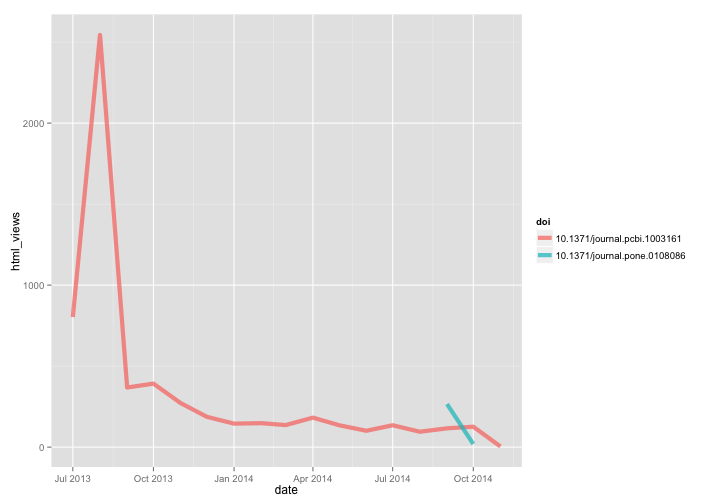
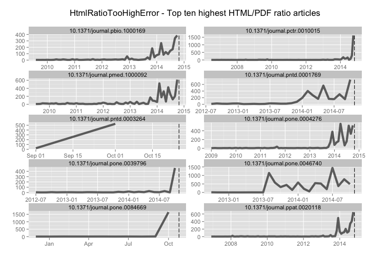
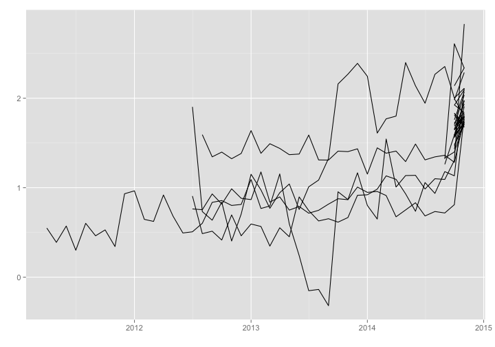
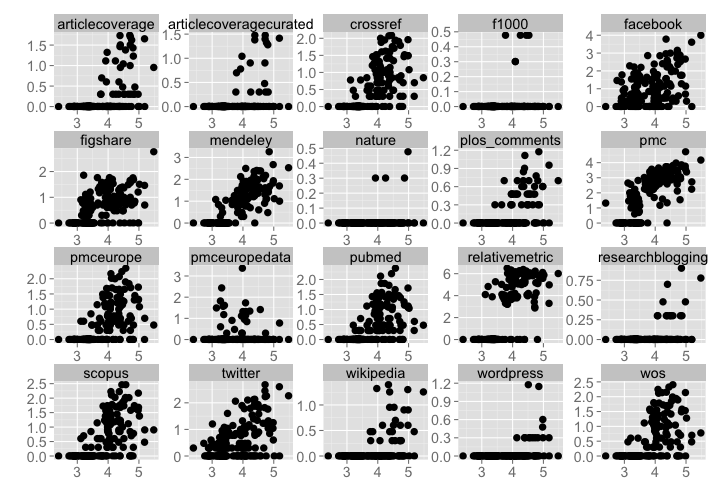

Workflow for detecting and exploring just outliers
========================================================


### Date 

Compiled on 2014-10-22 18:57:31

### Setup

> change directory to /data-quality/alerts/


Install `alm` if not installed already, then load package


```r
# source functions
source("helper_fxns.R")

# install.packages('stringr')
# devtools::install_github("ropensci/alm", ref="dev")
library('stringr')
library('alm')
library('plyr')
library('dplyr')
library('tidyr')
library('assertthat')
library('ggplot2')
library('lubridate')
library('knitr')
```


### Get alerts data by alert class

#### By class, change class_name var at top


```r
class_name = 'HtmlRatioTooHighError'
```

Get data


```r
(res <- alerts_by_class(class_name, limit=2000))
```

```
## Source: local data frame [228 x 6]
## 
##          id                      article     val          create_date
## 1  12262584 10.1371/journal.pone.0084669 1637.00 2014-10-18T08:33:04Z
## 2  12067540 10.1371/journal.pctr.0010015 1349.00 2014-10-14T08:10:25Z
## 3  12312904 10.1371/journal.pntd.0001985  653.00 2014-10-19T08:37:46Z
## 4  12262576 10.1371/journal.pntd.0001769  637.00 2014-10-18T08:33:04Z
## 5  12312930 10.1371/journal.pone.0043593  607.00 2014-10-19T08:37:48Z
## 6  12354474 10.1371/journal.ppat.0020118  568.00 2014-10-20T08:07:07Z
## 7  12412654 10.1371/journal.pmed.1000092  535.00 2014-10-21T08:07:05Z
## 8  12067310 10.1371/journal.pone.0046740  513.66 2014-10-14T08:10:24Z
## 9  12067488 10.1371/journal.pntd.0003264  453.25 2014-10-14T08:10:25Z
## 10 12067374 10.1371/journal.pbio.0030339  426.93 2014-10-14T08:10:25Z
## ..      ...                          ...     ...                  ...
## Variables not shown: source (chr), class (chr)
```

```r
# remove bad data
res <- res %>%
  filter(!is.na(article))
```

Extract top N articles, get DOIs


```r
num_get <- 10
toinspect <- res[1:num_get,] %>% select(-class)
(dois <- toinspect$article)
```

```
##  [1] "10.1371/journal.pone.0084669" "10.1371/journal.pctr.0010015"
##  [3] "10.1371/journal.pntd.0001985" "10.1371/journal.pntd.0001769"
##  [5] "10.1371/journal.pone.0043593" "10.1371/journal.ppat.0020118"
##  [7] "10.1371/journal.pmed.1000092" "10.1371/journal.pone.0046740"
##  [9] "10.1371/journal.pntd.0003264" "10.1371/journal.pbio.0030339"
```

Browse to an article


```r
browseURL(sprintf("http://alm.plos.org/articles/info:doi/%s", res$article[2]))
```


Get ALM events data and merge alerts data to it


```r
alldf <- add_events_data(toinspect, dois)
```

```
## Joining by: "article"
```

ggplot elements to reuse


```r
gg <- function(){
  list(geom_line(size = 2, alpha = 0.6),
       geom_vline(aes(xintercept=as.numeric(create_date)), linetype="longdash"),
       ggtitle("HtmlRatioTooHighError - Top ten highest HTML/PDF ratio articles\n"),
       facet_wrap(~ article, ncol = 2, scales = "free"),
       labs(y="", x=""),
       theme_grey(base_size = 14))
}
```

The distribution of html/pdf ratios


```r
res %>%
  ggplot(aes(x=val)) + geom_histogram()
```

```
## stat_bin: binwidth defaulted to range/30. Use 'binwidth = x' to adjust this.
```

 


Plot html and pdf views, just top 10


```r
alldf %>%
  select(-year, -month, -id, -val, -source, -xml_views, -ratio) %>%
  gather(metric, value, -article, -date, -create_date) %>% 
  ggplot(aes(date, value, color=metric)) + gg()
```

 

The HTML/PDF ratio, just top 10


```r
alldf %>%
  select(-year, -month, -id, -val, -source, -xml_views, -html_views, -pdf_views) %>%
  ggplot(aes(date, ratio)) + gg()
```

 

All ratio lines together


```r
(alldf_alldois <- add_events_data(res, res$article))
```

```
## Joining by: "article"
```

```
## Source: local data frame [4,390 x 13]
## 
##                         article year month pdf_views html_views xml_views
## 1  10.1371/journal.pgen.1004744 2014    10         5        760         5
## 2  10.1371/journal.ppat.1004494 2014    10         9       1204         4
## 3  10.1371/journal.pntd.0003293 2014    10        12       1650         5
## 4  10.1371/journal.pntd.0003277 2014     9         4         84         5
## 5  10.1371/journal.pntd.0003277 2014    10         7       1990         5
## 6  10.1371/journal.pntd.0003196 2014     9        39        436         6
## 7  10.1371/journal.pntd.0003196 2014    10        14       2317         3
## 8  10.1371/journal.pntd.0003264 2014     9        11        232         9
## 9  10.1371/journal.pntd.0003264 2014    10         4       1918         2
## 10 10.1371/journal.pntd.0003137 2014     9        30        502        13
## ..                          ...  ...   ...       ...        ...       ...
## Variables not shown: id (int), val (dbl), create_date (date), source
##   (chr), class (chr), date (date), ratio (dbl)
```

```r
alldf_alldois %>%
  select(article, date, create_date, ratio) %>%
  ggplot(aes(date, log10(ratio), group=article)) + 
    geom_line() +
    labs(y="", x="") +
    theme_grey(base_size = 14)
```

 

Dig in to particular DOIs. This is rather free-form, depends on the metric of interest.


```r
doi1 <- '10.1371/journal.pbio.0040066'
alm_events(doi1, source = "facebook")
alm_ids(doi1, info = "detail")
```

Are the high value offender DOIs associated with other altmetrics, like social media metrics

Get data from `alm` R package


```r
dat <- alm_ids(res$article)
```


```r
datdf <- rbind_all(
  Map(function(x, y) data.frame(article=y, x, stringsAsFactors = FALSE), dat$data, res$article)
)
datdf <- inner_join(datdf, res %>% filter(article %in% res$article) %>% select(article, val))
```

```
## Joining by: "article"
```

Get html views for each article, join to data


```r
htmls <- datdf %>% filter(.id == "counter") %>% select(article, html) %>% rename(html_views=html)
datdf <- inner_join(datdf, htmls)
```

```
## Joining by: "article"
```

Select a subset of metrics


```r
datdf <- datdf %>%
  filter(!.id %in% c('citeulike','copernicus','datacite','openedition',
                     'scienceseeker','counter','reddit'))
```

Plot the data


```r
datdf %>% 
  ggplot(aes(x=log10(html_views+1), y=log10(total+1))) + 
    geom_point(aes(size=2)) +
    facet_wrap(~ .id, scales='free') +
    labs(y="", x="") +
    theme_grey(base_size = 18) +
    theme(legend.position="none")
```

 

Are there combinations of metrics that give stronger prediction of the outlier articles


```r
log10_1 <- function(x) log10(x + 1)

analyze <- datdf %>%
  filter(.id %in% c("twitter","facebook","mendeley","wikipedia")) %>%
  select(article, .id, total, html_views) %>%
  spread(.id, total)

analyze$html_views <- log10_1(analyze$html_views)
analyze$facebook <- log10_1(analyze$facebook)
analyze$mendeley <- log10_1(analyze$mendeley)
analyze$twitter <- log10_1(analyze$twitter)
analyze$wikipedia <- log10_1(analyze$wikipedia)
  
analyze %>%
  lm(html_views ~ facebook + mendeley + twitter + wikipedia, data = .) %>%
  summary
```

```
## 
## Call:
## lm(formula = html_views ~ facebook + mendeley + twitter + wikipedia, 
##     data = analyze)
## 
## Residuals:
##      Min       1Q   Median       3Q      Max 
## -0.85900 -0.14207  0.00603  0.10889  1.46120 
## 
## Coefficients:
##             Estimate Std. Error t value Pr(>|t|)    
## (Intercept)  3.20746    0.02882 111.287  < 2e-16 ***
## facebook     0.09446    0.03232   2.923  0.00383 ** 
## mendeley     0.51913    0.02564  20.244  < 2e-16 ***
## twitter      0.14693    0.04618   3.182  0.00167 ** 
## wikipedia    0.13729    0.08763   1.567  0.11862    
## ---
## Signif. codes:  0 '***' 0.001 '**' 0.01 '*' 0.05 '.' 0.1 ' ' 1
## 
## Residual standard error: 0.2803 on 222 degrees of freedom
## Multiple R-squared:  0.7716,	Adjusted R-squared:  0.7674 
## F-statistic: 187.5 on 4 and 222 DF,  p-value: < 2.2e-16
```


Detect spikes/patterns in signals through time


```r
'not done yet...'
```

> based on the above work, identify which articles are deserving of further inspection/flagging - perhaps need to look at log files for IP addresses, etc.
