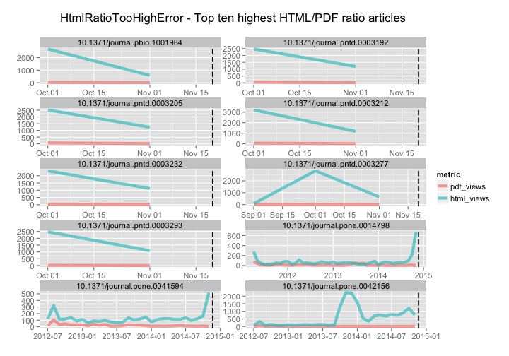
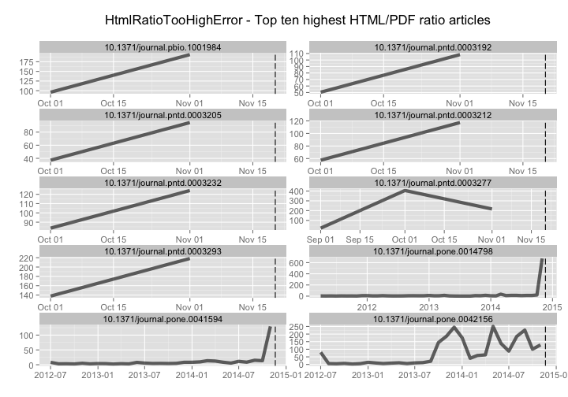
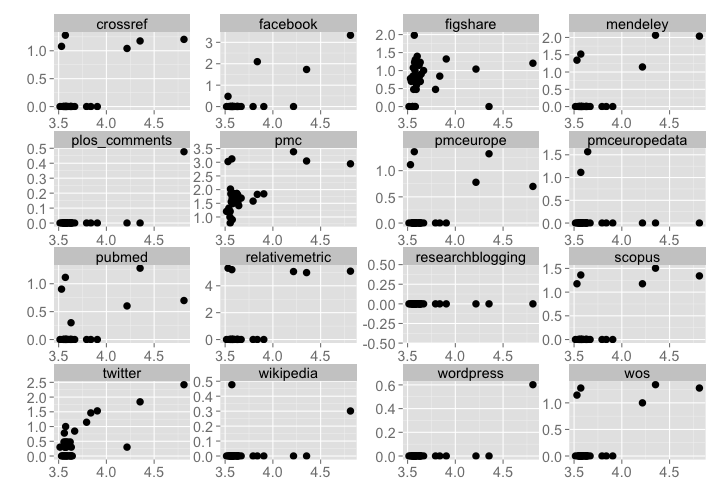

Workflow for detecting and exploring just outliers
========================================================


### Date 

Compiled on 2014-11-20 18:33:05

### Setup

> change directory to /data-quality/alerts/


Install `alm` if not installed already, then load package


```r
# source functions
source("helper_fxns.R")

# install.packages('stringr')
# devtools::install_github("ropensci/alm", ref="dev")
library('stringr')
library('alm')
library('plyr')
library('dplyr')
library('tidyr')
library('assertthat')
library('ggplot2')
library('lubridate')
library('knitr')
```


### Get alerts data by alert class

#### By class, change class_name var at top


```r
class_name = 'HtmlRatioTooHighError'
```

Get data


```r
(res <- alerts_by_class(class_name, limit=2000))
```

```
## Source: local data frame [34 x 6]
## 
##          id                      article    val          create_date
## 1  14084194 10.1371/journal.pone.0014798 625.00 2014-11-20T09:05:11Z
## 2  14084166 10.1371/journal.pntd.0003293 517.00 2014-11-20T09:05:11Z
## 3  14084132 10.1371/journal.pntd.0003277 322.00 2014-11-20T09:05:11Z
## 4  14084168 10.1371/journal.pbio.1001984 193.66 2014-11-20T09:05:11Z
## 5  14084162 10.1371/journal.pone.0041594 170.00 2014-11-20T09:05:11Z
## 6  14084188 10.1371/journal.pntd.0003232 150.85 2014-11-20T09:05:11Z
## 7  14084156 10.1371/journal.pntd.0003212 138.87 2014-11-20T09:05:11Z
## 8  14084176 10.1371/journal.pntd.0003192 125.33 2014-11-20T09:05:11Z
## 9  14084190 10.1371/journal.pone.0042156 122.66 2014-11-20T09:05:11Z
## 10 14084180 10.1371/journal.pntd.0003205 116.40 2014-11-20T09:05:11Z
## 11 14084186 10.1371/journal.pntd.0003223 105.90 2014-11-20T09:05:11Z
## 12 14084130 10.1371/journal.pmed.1001738  88.60 2014-11-20T09:05:11Z
## 13 14084174 10.1371/journal.pntd.0003188  88.30 2014-11-20T09:05:11Z
## 14 14084158 10.1371/journal.pntd.0003217  86.76 2014-11-20T09:05:11Z
## 15 14084144 10.1371/journal.pntd.0003197  78.14 2014-11-20T09:05:11Z
## 16 14084138 10.1371/journal.pntd.0003114  75.88 2014-11-20T09:05:11Z
## 17 14084148 10.1371/journal.pntd.0003201  73.77 2014-11-20T09:05:11Z
## 18 14084184 10.1371/journal.pntd.0003222  73.73 2014-11-20T09:05:11Z
## 19 14084160 10.1371/journal.pntd.0003227  73.00 2014-11-20T09:05:11Z
## 20 14084140 10.1371/journal.pntd.0003142  72.00 2014-11-20T09:05:11Z
## 21 14084154 10.1371/journal.pntd.0003210  71.31 2014-11-20T09:05:11Z
## 22 14084178 10.1371/journal.pntd.0003204  69.50 2014-11-20T09:05:11Z
## 23 14084182 10.1371/journal.pntd.0003214  68.87 2014-11-20T09:05:11Z
## 24 14084164 10.1371/journal.pmed.1001739  65.03 2014-11-20T09:05:11Z
## 25 14084142 10.1371/journal.pntd.0003173  64.09 2014-11-20T09:05:11Z
## 26 14084172 10.1371/journal.pntd.0003155  64.00 2014-11-20T09:05:11Z
## 27 14084170 10.1371/journal.pntd.0003152  63.88 2014-11-20T09:05:11Z
## 28 14084134 10.1371/journal.pcbi.1002616  61.18 2014-11-20T09:05:11Z
## 29 14084150 10.1371/journal.pntd.0003206  61.11 2014-11-20T09:05:11Z
## 30 14084152 10.1371/journal.pntd.0003207  61.00 2014-11-20T09:05:11Z
## 31 14084146 10.1371/journal.pntd.0003198  59.94 2014-11-20T09:05:11Z
## 32 14084192 10.1371/journal.pone.0042366  56.04 2014-11-20T09:05:11Z
## 33 14084136 10.1371/journal.pntd.0003072  54.92 2014-11-20T09:05:11Z
## 34 14084128 10.1371/journal.pmed.1001737  51.42 2014-11-20T09:05:11Z
## Variables not shown: source (chr), class (chr)
```

```r
# remove bad data
res <- res %>%
  filter(!is.na(article))
```

Extract top N articles, get DOIs


```r
num_get <- 10
toinspect <- res[1:num_get,] %>% select(-class)
(dois <- toinspect$article)
```

```
##  [1] "10.1371/journal.pone.0014798" "10.1371/journal.pntd.0003293"
##  [3] "10.1371/journal.pntd.0003277" "10.1371/journal.pbio.1001984"
##  [5] "10.1371/journal.pone.0041594" "10.1371/journal.pntd.0003232"
##  [7] "10.1371/journal.pntd.0003212" "10.1371/journal.pntd.0003192"
##  [9] "10.1371/journal.pone.0042156" "10.1371/journal.pntd.0003205"
```

Browse to an article


```r
browseURL(sprintf("http://alm.plos.org/articles/info:doi/%s", res$article[2]))
```


Get ALM events data and merge alerts data to it


```r
alldf <- add_events_data(toinspect, dois)
```

ggplot elements to reuse


```r
gg <- function(){
  list(geom_line(size = 2, alpha = 0.6),
       geom_vline(aes(xintercept=as.numeric(create_date)), linetype="longdash"),
       ggtitle("HtmlRatioTooHighError - Top ten highest HTML/PDF ratio articles\n"),
       facet_wrap(~ article, ncol = 2, scales = "free"),
       labs(y="", x=""),
       theme_grey(base_size = 14))
}
```

The distribution of html/pdf ratios


```r
res %>%
  ggplot(aes(x=val)) + geom_histogram()
```

 


Plot html and pdf views, just top 10


```r
alldf %>%
  select(-year, -month, -id, -val, -source, -xml_views, -ratio) %>%
  gather(metric, value, -article, -date, -create_date) %>% 
  ggplot(aes(date, value, color=metric)) + gg()
```

 

The HTML/PDF ratio, just top 10


```r
alldf %>%
  select(-year, -month, -id, -val, -source, -xml_views, -html_views, -pdf_views) %>%
  ggplot(aes(date, ratio)) + gg()
```

 

All ratio lines together


```r
(alldf_alldois <- add_events_data(res, res$article))
```

```
## Source: local data frame [220 x 13]
## 
##                         article year month pdf_views html_views xml_views
## 1  10.1371/journal.pbio.1001984 2014    10        28       2688         8
## 2  10.1371/journal.pbio.1001984 2014    11         3        581         0
## 3  10.1371/journal.pntd.0003152 2014    10        84       2444        14
## 4  10.1371/journal.pntd.0003152 2014    11        21       1151         0
## 5  10.1371/journal.pntd.0003155 2014    10        69       2592        13
## 6  10.1371/journal.pntd.0003155 2014    11        21       1150         1
## 7  10.1371/journal.pntd.0003188 2014    10        99       2679        15
## 8  10.1371/journal.pntd.0003188 2014    11        15       1212         3
## 9  10.1371/journal.pntd.0003192 2014    10        49       2472        13
## 10 10.1371/journal.pntd.0003192 2014    11        11       1192         1
## ..                          ...  ...   ...       ...        ...       ...
## Variables not shown: id (int), val (dbl), create_date (date), source
##   (chr), class (chr), date (date), ratio (dbl)
```

```r
alldf_alldois %>%
  select(article, date, create_date, ratio) %>%
  ggplot(aes(date, log10(ratio), group=article)) + 
    geom_line() +
    labs(y="", x="") +
    theme_grey(base_size = 14)
```

 

Dig in to particular DOIs. This is rather free-form, depends on the metric of interest.


```r
doi1 <- '10.1371/journal.pbio.0040066'
alm_events(doi1, source = "facebook")
alm_ids(doi1, info = "detail")
```

Are the high value offender DOIs associated with other altmetrics, like social media metrics

Get data from `alm` R package


```r
dat <- alm_ids(res$article)
```


```r
datdf <- rbind_all(
  Map(function(x, y) data.frame(article=y, x, stringsAsFactors = FALSE), dat$data, res$article)
)
datdf <- inner_join(datdf, res %>% filter(article %in% res$article) %>% select(article, val))
```

Get html views for each article, join to data


```r
htmls <- datdf %>% filter(.id == "counter") %>% select(article, html) %>% rename(html_views=html)
datdf <- inner_join(datdf, htmls)
```

Select a subset of metrics


```r
datdf <- datdf %>%
  filter(!.id %in% c('citeulike','copernicus','datacite','openedition',
                     'scienceseeker','counter','reddit','articlecoveragecurated',
                     'articlecoverage','nature','f1000'))
```

Plot the data


```r
datdf %>% 
  ggplot(aes(x=log10(html_views+1), y=log10(total+1))) + 
    geom_point(aes(size=2)) +
    facet_wrap(~ .id, scales='free') +
    labs(y="", x="") +
    theme_grey(base_size = 18) +
    theme(legend.position="none")
```

 

Are there combinations of metrics that give stronger prediction of the outlier articles

> only looking at interactions among variables when there is sufficient sample size


```r
log10_1 <- function(x) log10(x + 1)

analyze <- datdf %>%
  filter(.id %in% c("twitter","facebook","mendeley","wikipedia")) %>%
  select(article, .id, total, html_views) %>%
  spread(.id, total)

analyze$html_views <- log10_1(analyze$html_views)
analyze$facebook <- log10_1(analyze$facebook)
analyze$mendeley <- log10_1(analyze$mendeley)
analyze$twitter <- log10_1(analyze$twitter)
analyze$wikipedia <- log10_1(analyze$wikipedia)
  
analyze %>%
  lm(html_views ~ facebook + mendeley + twitter + wikipedia, data = .) %>%
  summary
```

```
## 
## Call:
## lm(formula = html_views ~ facebook + mendeley + twitter + wikipedia, 
##     data = analyze)
## 
## Residuals:
##      Min       1Q   Median       3Q      Max 
## -0.34425 -0.05060  0.00133  0.05344  0.38445 
## 
## Coefficients:
##             Estimate Std. Error t value Pr(>|t|)    
## (Intercept)  3.55183    0.02880 123.306  < 2e-16 ***
## facebook     0.10957    0.05449   2.011  0.05374 .  
## mendeley     0.20148    0.05751   3.504  0.00151 ** 
## twitter      0.16232    0.05601   2.898  0.00708 ** 
## wikipedia   -0.41710    0.29707  -1.404  0.17092    
## ---
## Signif. codes:  0 '***' 0.001 '**' 0.01 '*' 0.05 '.' 0.1 ' ' 1
## 
## Residual standard error: 0.129 on 29 degrees of freedom
## Multiple R-squared:  0.7988,	Adjusted R-squared:  0.7711 
## F-statistic: 28.79 on 4 and 29 DF,  p-value: 1.002e-09
```

Detect spikes/patterns in signals through time


```r
'not done yet...'
```

> based on the above work, identify which articles are deserving of further inspection/flagging - perhaps need to look at log files for IP addresses, etc.
