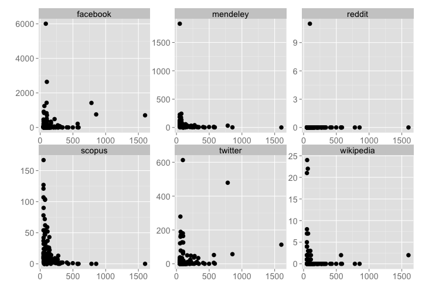

Workflow for detecting and exploring just outliers
========================================================

### Setup

> change directory to /data-quality/alerts/


Install `alm` if not installed already, then load package


```r
# source helper fxns
source("helper_fxns.R")

# install.packages('stringr')
# devtools::install_github("ropensci/alm", ref="dev")
library('stringr')
library('alm')
library('plyr')
library('dplyr')
library('tidyr')
library('assertthat')
library('ggplot2')
library('lubridate')
```


### Get alerts data by alert class

#### get data cached for three impt alert classes


```r
classes <- c('HtmlRatioTooHighError','EventCountDecreasingError','EventCountIncreasingTooFastError')
res <- lapply(classes, alerts_by_class, limit=1000)
(resdf <- tbl_df(rbind_all(res)))
```


#### By class, change class_name var at top


```r
class_name = 'HtmlRatioTooHighError'
```

Get data


```r
(res <- alerts_by_class(class_name, limit=2000))
```

```
## Source: local data frame [138 x 6]
## 
##          id                      article   val          create_date
## 1  11313611 10.1371/journal.pone.0051213 855.0 2014-09-27T08:08:33Z
## 2  11313489 10.1371/journal.pone.0010894 783.0 2014-09-27T08:08:32Z
## 3  11313569 10.1371/journal.pone.0046740 774.2 2014-09-27T08:08:32Z
## 4  11347639 10.1371/journal.pone.0023786 586.0 2014-09-29T08:07:01Z
## 5  11313595 10.1371/journal.pmed.1001493 570.7 2014-09-27T08:08:33Z
## 6  11313573 10.1371/journal.pone.0090595 480.1 2014-09-27T08:08:32Z
## 7  11313511 10.1371/journal.ppat.1003183 430.0 2014-09-27T08:08:32Z
## 8  11313477 10.1371/journal.ppat.0020118 407.5 2014-09-27T08:08:32Z
## 9  11313513 10.1371/journal.pbio.1000169 341.3 2014-09-27T08:08:32Z
## 10 11313645 10.1371/journal.pone.0004276 333.0 2014-09-27T08:08:33Z
## ..      ...                          ...   ...                  ...
## Variables not shown: source (chr), class (chr)
```

Extract top N articles, get DOIs


```r
num_get <- 10
toinspect <- res[1:num_get,] %>% select(-class)
(dois <- toinspect$article)
```

```
##  [1] "10.1371/journal.pone.0051213" "10.1371/journal.pone.0010894"
##  [3] "10.1371/journal.pone.0046740" "10.1371/journal.pone.0023786"
##  [5] "10.1371/journal.pmed.1001493" "10.1371/journal.pone.0090595"
##  [7] "10.1371/journal.ppat.1003183" "10.1371/journal.ppat.0020118"
##  [9] "10.1371/journal.pbio.1000169" "10.1371/journal.pone.0004276"
```

Browse to an article


```r
browseURL(sprintf("http://alm.plos.org/articles/info:doi/%s", res$article[2]))
```


Get ALM events data and merge alerts data to it


```r
alldf <- add_events_data(toinspect, dois)
```

```
## Joining by: "article"
```

ggplot elements to reuse


```r
gg <- function(){
  list(geom_line(size = 2, alpha = 0.6),
       geom_vline(aes(xintercept=as.numeric(create_date)), linetype="longdash"),
       ggtitle("HtmlRatioTooHighError - Top ten highest HTML/PDF ratio articles\n"),
       facet_wrap(~ article, ncol = 2, scales = "free"),
       labs(y="", x=""),
       theme_grey(base_size = 14))
}
```

Plot html and pdf views, just top 10


```r
alldf %>%
  select(-year, -month, -id, -val, -source, -xml_views, -ratio) %>%
  gather(metric, value, -article, -date, -create_date) %>% 
  ggplot(aes(date, value, color=metric)) + gg()
```

 

The HTML/PDF ratio, just top 10


```r
alldf %>%
  select(-year, -month, -id, -val, -source, -xml_views, -html_views, -pdf_views) %>%
  ggplot(aes(date, ratio)) + gg()
```

 

All ratio lines together, all 138


```r
(alldf_alldois <- add_events_data(res, res$article))
```

```
## Joining by: "article"
```

```
## Source: local data frame [5,173 x 13]
## 
##                         article year month pdf_views html_views xml_views
## 1  10.1371/journal.pone.0095298 2014     4       563      27151        12
## 2  10.1371/journal.pone.0095298 2014     5       235      11094         3
## 3  10.1371/journal.pone.0095298 2014     6        58       3253         3
## 4  10.1371/journal.pone.0095298 2014     7        28       1830         1
## 5  10.1371/journal.pone.0095298 2014     8        40       4479         2
## 6  10.1371/journal.pone.0095298 2014     9        17       1772         1
## 7  10.1371/journal.pone.0094215 2014     4      1119      36758        34
## 8  10.1371/journal.pone.0094215 2014     5       269       5058         5
## 9  10.1371/journal.pone.0094215 2014     6        65       2885         0
## 10 10.1371/journal.pone.0094215 2014     7        33       1637         1
## ..                          ...  ...   ...       ...        ...       ...
## Variables not shown: id (dbl), val (dbl), create_date (date), source
##   (chr), class (chr), date (date), ratio (dbl)
```

```r
alldf_alldois %>%
  select(article, date, create_date, ratio) %>%
  ggplot(aes(date, log10(ratio), group=article)) + 
    geom_line() +
    labs(y="", x="") +
    theme_grey(base_size = 14)
```

 

Dig in to particular DOIs. This is rather free-form, depends on the metric of interest.


```r
doi1 <- '10.1371/journal.pbio.0040066'
alm_events(doi1, source = "facebook")
alm_ids(doi1, info = "detail")
```

Are the high value offender DOIs associated with other alm metrics, like social media metrics


```r
dat <- alm_ids(res$article[1:50], source = c("facebook","twitter","mendeley","reddit","scopus","wikipedia"))
datdf <- rbind_all(dat$data)
datdf$article <- rep(res$article[1:50], each = 6)
datdf <- inner_join(datdf, res %>% filter(article %in% res$article[1:20]) %>% select(article, val) )
```

```
## Joining by: "article"
```

```r
datdf %>% 
  ggplot(aes(x=val, y=total)) + 
    geom_point(aes(size=2)) +
    facet_wrap(~ .id, scales='free') +
    labs(y="", x="") +
    theme_grey(base_size = 18) +
    theme(legend.position="none")
```

 


Detect spikes/patterns in signals through time


```r
'....'
```

> based on the above work, identify which articles are deserving of further inspection/flagging - perhaps need to look at log files for IP addresses, etc.
