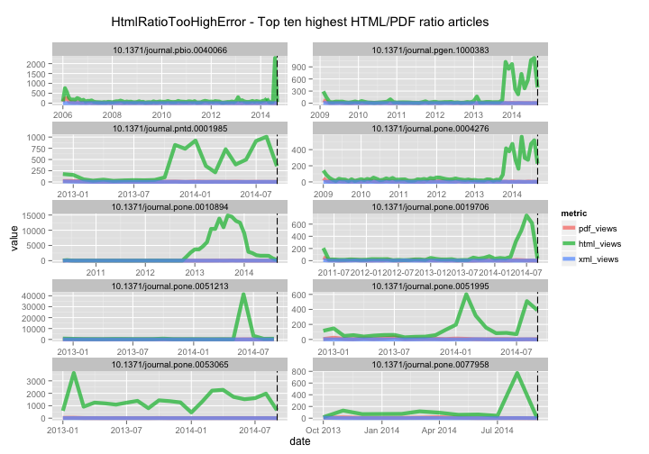

Workflow for detecting and exploring just outliers
========================================================

### Setup

> change directory to /data-quality/alerts/


Install `alm` if not installed already, then load package


```r
# source helper fxns
source("helper_fxns.R")

# install.packages('stringr')
# devtools::install_github("ropensci/alm", ref="dev")
library('stringr')
library('alm')
library('plyr')
library('dplyr')
library('tidyr')
library('assertthat')
library('ggplot2')
library('lubridate')
```

### Get alerts data by alert class

#### get data cached for three impt alert classes


```r
classes <- c('HtmlRatioTooHighError','EventCountDecreasingError', 'EventCountIncreasingTooFastError')
res <- lapply(classes, alerts_by_class, limit=1000)
(resdf <- tbl_df(rbind_all(res)))
```


#### HtmlRatioTooHighError

Get data


```r
(res <- alerts_by_class(class_name = 'HtmlRatioTooHighError'))
```

```
## Source: local data frame [161 x 6]
## 
##          id                      article    val          create_date
## 1  11099071 10.1371/journal.pgen.1000383 1121.0 2014-09-02T08:04:24Z
## 2  11099175 10.1371/journal.pntd.0001985 1008.0 2014-09-02T08:04:24Z
## 3  11099195 10.1371/journal.pone.0077958  772.0 2014-09-02T08:04:24Z
## 4  11098993 10.1371/journal.pone.0010894  732.0 2014-09-02T08:04:23Z
## 5  11099095 10.1371/journal.pone.0019706  616.0 2014-09-02T08:04:24Z
## 6  11099205 10.1371/journal.pone.0053065  580.0 2014-09-02T08:04:24Z
## 7  11144043 10.1371/journal.pone.0051213  557.0 2014-09-11T08:05:27Z
## 8  11099233 10.1371/journal.pone.0004276  516.0 2014-09-02T08:04:24Z
## 9  11099191 10.1371/journal.pone.0051995  510.0 2014-09-02T08:04:24Z
## 10 11098995 10.1371/journal.pbio.0040066  456.8 2014-09-02T08:04:23Z
## ..      ...                          ...    ...                  ...
## Variables not shown: source (chr), class (chr)
```

Extract top N articles, get DOIs


```r
toinspect <- res[1:10,] %>% select(-class)
(dois <- toinspect$article)
```

```
##  [1] "10.1371/journal.pgen.1000383" "10.1371/journal.pntd.0001985"
##  [3] "10.1371/journal.pone.0077958" "10.1371/journal.pone.0010894"
##  [5] "10.1371/journal.pone.0019706" "10.1371/journal.pone.0053065"
##  [7] "10.1371/journal.pone.0051213" "10.1371/journal.pone.0004276"
##  [9] "10.1371/journal.pone.0051995" "10.1371/journal.pbio.0040066"
```

Get ALM events data and merge alerts data to it


```r
events <- alm_events(dois, source = "counter")
foo <- function(x, y){
  tmp <- x$counter$events
  data.frame(article=y, tmp, stringsAsFactors = FALSE)
}
events <- Map(foo, events, names(events))
eventsdf <- tbl_df(rbind_all(events))
alldf <- inner_join(x=eventsdf, y=toinspect)
```

```
## Joining by: "article"
```

```r
alldf <- alldf %>% 
    mutate(date = as.Date(sprintf('%s-%s-01', year, month))) 
alldf$create_date <- as.Date(ymd_hms(alldf$create_date))
```

Plot data, top 10 DOIs


```r
alldf %>%
  select(-year, -month, -id, -val, -source) %>%
  gather(metric, value, -article, -date, -create_date) %>%
#   arrange() %>%
  ggplot(aes(date, value, color=metric)) + 
    geom_line(size = 2, alpha = 0.7) + 
    geom_vline(aes(xintercept=as.numeric(create_date)), linetype="longdash") +
    facet_wrap(~ article, ncol = 2, scales = "free") +
    ggtitle("HtmlRatioTooHighError - Top ten highest HTML/PDF ratio articles\n")
```

 

Dig in to particular DOIs. This is rather free-form, depends on the metric of interest.


```r
doi1 <- '10.1371/journal.pbio.0040066'
alm_events(doi1, source = "facebook")
alm_ids(doi1, info = "detail")
```

Detect spikes


```r
'....'
```

```
## [1] "...."
```

> based on the above work, identify which articles are deserving of further inspection/flagging - perhaps need to look at log files for IP addresses, etc.
