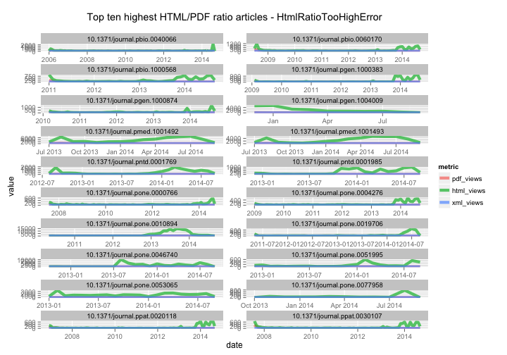

Workflow for detecting and exploring just outliers
========================================================

### Setup

> change directory to /data-quality/alerts/


Install `alm` if not installed already, then load package


```r
# source helper fxns
source("helper_fxns.R")

# install.packages('stringr')
# devtools::install_github("ropensci/alm", ref="dev")
library('stringr')
library('alm')
library('plyr')
library('dplyr')
library('tidyr')
library('assertthat')
library('ggplot2')
```

### Get alerts data by alert class

#### HtmlRatioTooHighError

Get data


```r
(res <- alerts_by_class(class_name = 'HtmlRatioTooHighError'))
```

```
## Source: local data frame [192 x 5]
## 
##          id                      article    val          create_date
## 1  11099071 10.1371/journal.pgen.1000383 1121.0 2014-09-02T08:04:24Z
## 2  11099175 10.1371/journal.pntd.0001985 1008.0 2014-09-02T08:04:24Z
## 3  11099195 10.1371/journal.pone.0077958  772.0 2014-09-02T08:04:24Z
## 4  11098993 10.1371/journal.pone.0010894  732.0 2014-09-02T08:04:23Z
## 5  11099155 10.1371/journal.pmed.1001493  696.8 2014-09-02T08:04:24Z
## 6  11099095 10.1371/journal.pone.0019706  616.0 2014-09-02T08:04:24Z
## 7  11099153 10.1371/journal.pmed.1001492  592.0 2014-09-02T08:04:24Z
## 8  11099233 10.1371/journal.pone.0004276  516.0 2014-09-02T08:04:24Z
## 9  11099191 10.1371/journal.pone.0051995  510.0 2014-09-02T08:04:24Z
## 10 11098995 10.1371/journal.pbio.0040066  456.8 2014-09-02T08:04:23Z
## ..      ...                          ...    ...                  ...
## Variables not shown: source (chr)
```

Extract top 10, get DOIs


```r
toinspect <- res[1:10,]
dois <- toinspect$article
```

Get ALM events data and merge alerts data to it


```r
deets <- alm_ids(dois, info = "detail")
details <- deets$data
events <- alm_events(dois, source = "counter")
foo <- function(x, y){
  tmp <- x$counter$events
  data.frame(article=y, tmp, stringsAsFactors = FALSE)
}
events <- Map(foo, events, dois)
eventsdf <- tbl_df(rbind_all(events))
alldf <- inner_join(x=eventsdf, y=toinspect)
```

```
## Joining by: "article"
```

```r
alldf <- alldf %>% 
    mutate(date = as.Date(sprintf('%s-%s-01', year, month)))
```

Plot data


```r
alldf %>%
  select(-year, -month, -id, -val, -create_date, -source) %>%
  gather(metric, value, -article, -date) %>%
  ggplot(aes(date, value, color=metric)) + 
    geom_line() + 
    facet_wrap(~ article, ncol = 2, scales = "free") +
    ggtitle("Top ten highest HTML/PDF ratio articles - HtmlRatioTooHighError\n")
```

 
