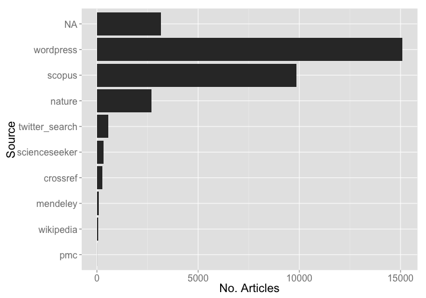

PKP Report
========================================================


### Date 

Compiled on 2014-10-31 17:34:40

### Setup

> change directory to /data-quality/alerts


Install `alm` if not installed already, then load package


```r
# source functions
source("helper_fxns.R")

# install.packages('stringr')
# devtools::install_github("ropensci/alm", ref="dev")
library('stringr')
library('alm')
library('plyr')
library('dplyr')
library('tidyr')
library('assertthat')
library('ggplot2')
library('lubridate')
library('knitr')
```


```r
knitr::purl("alertssetup.Rmd")
source("alertssetup.R")
unlink("alertssetup.R")
```

### Set up variables


```r
url <- 'http://pkp-alm.lib.sfu.ca/api/v4/alerts'
user <- getOption('almv4_pkp_user')
pwd <- getOption('almv4_pkp_pwd')
pkp_v5_key <- getOption('pkpalmkey')
```

### Get all data


```r
meta <- alm_alerts(url = url, user = user, pwd = pwd)$meta
res <- lapply(1:meta$total_pages, function(x) alm_alerts(page=x, url=url, user=user, pwd=pwd))
(resdf <- do.call(rbind, lapply(res, "[[", "data")) %>% 
   tbl_df %>% 
   select(id, level, class_name, article, status, source, create_date, target_url))
```

```
## Source: local data frame [1,568 x 8]
## 
##         id level                  class_name
## 1  1611808 ERROR               StandardError
## 2  1611807  WARN Net::HTTPServiceUnavailable
## 3  1611806  WARN Net::HTTPServiceUnavailable
## 4  1611805  WARN Net::HTTPServiceUnavailable
## 5  1611804  WARN Net::HTTPServiceUnavailable
## 6  1611803  WARN Net::HTTPServiceUnavailable
## 7  1611802  WARN Net::HTTPServiceUnavailable
## 8  1611801  WARN Net::HTTPServiceUnavailable
## 9  1611800  WARN Net::HTTPServiceUnavailable
## 10 1611799  WARN Net::HTTPServiceUnavailable
## ..     ...   ...                         ...
## Variables not shown: article (chr), status (int), source (chr),
##   create_date (chr), target_url (chr)
```

### Types of errors


```r
tabl <- resdf %>%
  group_by(class_name) %>%
  summarise(n = n()) %>%
  arrange(desc(n))

kable(tabl, format = "markdown")
```


|class_name                  |   n|
|:---------------------------|---:|
|Net::HTTPClientError        | 946|
|Net::HTTPForbidden          | 512|
|Net::HTTPRequestTimeOut     |  77|
|Net::HTTPServiceUnavailable |  10|
|ActiveRecord::RecordInvalid |   6|
|Net::HTTPBadGateway         |   5|
|StandardError               |   3|
|ActionView::MissingTemplate |   2|
|Faraday::ResourceNotFound   |   2|
|Net::HTTPNotAcceptable      |   2|
|TooManyErrorsBySourceError  |   2|
|Faraday::ClientError        |   1|

### Alerts by source

By source alone

> NOTE: the NA's are not mistakes, but what is given as the source


```r
resdf %>%
  group_by(source) %>%
  summarise(n = n()) %>%
  ggplot(aes(reorder(source, n), n)) +
    geom_histogram(stat = "identity") + 
    coord_flip() +
    theme_grey(base_size = 20) +
    labs(x = "Source", y = "No. Articles")
```

 

source X alert class


```r
resdf %>%
  group_by(source, class_name) %>%
  summarise(n = n()) %>%
  ggplot(aes(reorder(class_name, n), n, fill=source)) +
    geom_histogram(stat = "identity") + 
    coord_flip() +
    theme_grey(base_size = 20) +
    labs(x = "Source", y = "No. Articles") +
    theme(legend.position = "top")
```

 

### Define functions


```r
library('rcrossref')

splitdoi <- function(x) strsplit(x, "/")[[1]][[1]]

match_publisher <- function(x, y){
  names(y[ sapply(y, function(z) x %in% z) ])
}

table_summary <- function(x){  
  rr <- x %>%
    group_by(publisher) %>%
    summarise(n = n()) %>%
    arrange(desc(n))
  kable(na.omit(rr[1:10,]), format = "markdown")
}

get_prefixes <- function(x){
  uniqpre <- na.omit(unique(x))
  cr_prefixes(uniqpre)$data %>%
    rowwise %>%
    mutate(prefix_ = strsplit(sub("http://id.crossref.org/prefix/", "", prefix), "/")[[1]][[1]]) %>%
    select(-member, -prefix)
}
```

### Net::HTTPClient errors


```r
dat <- resdf %>%
  filter(class_name == "Net::HTTPClientError") %>%
  select(id, level, class_name, article, status, source, create_date, target_url) %>%
  rowwise %>%
  mutate(prefix_ = strsplit(article, "/")[[1]][[1]])

pre_resdf <- get_prefixes(dat$prefix_)

nethttpclient <- inner_join(dat, pre_resdf, "prefix_") %>%
  select(-article, -status, -source) %>%
  rename(prefix = prefix_, publisher = name)
table_summary(nethttpclient)
```


|publisher                                                            |   n|
|:--------------------------------------------------------------------|---:|
|Bangladesh Journals Online (JOL)                                     | 400|
|African Journals Online (AJOL)                                       | 212|
|Universidade de Sao Paulo Sistema Integrado de Bibliotecas - SIBiUSP | 109|
|Co-Action Publishing                                                 |  91|
|Universidade Federal de Santa Catarina (UFSC)                        |  40|
|Wiley-Blackwell                                                      |  27|
|Editora Cubo Multimidia                                              |  14|
|Informa UK Limited                                                   |   8|
|Latin America Journals Online                                        |   8|
|Nepal Journals Online (JOL)                                          |   7|

### Net::HTTPForbidden errors


```r
dat <- resdf %>%
  filter(class_name == "Net::HTTPForbidden") %>%
  select(id, level, class_name, article, status, source, create_date, target_url) %>%
  rowwise %>%
  mutate(prefix_ = strsplit(article, "/")[[1]][[1]])

pre_resdf <- get_prefixes(dat$prefix_)

nethttpforbidden <- inner_join(dat, pre_resdf, "prefix_") %>%
  select(-article, -status, -source) %>%
  rename(prefix = prefix_, publisher = name)
table_summary(nethttpforbidden)
```


|publisher                                                            |   n|
|:--------------------------------------------------------------------|---:|
|Universidad de Costa Rica                                            | 119|
|African Journals Online (AJOL)                                       | 104|
|Editora Cubo Multimidia                                              |  61|
|Nepal Journals Online (JOL)                                          |  55|
|Bangladesh Journals Online (JOL)                                     |  47|
|Co-Action Publishing                                                 |  41|
|Sri Lanka Journals Online (JOL)                                      |  26|
|Universidade de Sao Paulo Sistema Integrado de Bibliotecas - SIBiUSP |  17|
|Mongolian Journals Online                                            |  15|
|Universidade Federal de Santa Catarina (UFSC)                        |  13|

### Net::HTTPRequestTimeOut errors


```r
dat <- resdf %>%
  filter(class_name == "Net::HTTPRequestTimeOut") %>%
  select(id, level, class_name, article, status, source, create_date, target_url) %>%
  rowwise %>%
  mutate(prefix_ = str_extract(target_url, "10\\.[0-9]+"))

pre_resdf <- get_prefixes(dat$prefix_)

nethttprequesttimeout <- inner_join(dat, pre_resdf, "prefix_") %>%
  select(-article, -status, -source) %>%
  rename(prefix = prefix_, publisher = name)
table_summary(nethttprequesttimeout)
```


|publisher                                     |  n|
|:---------------------------------------------|--:|
|Bangladesh Journals Online (JOL)              | 47|
|Wiley-Blackwell                               | 11|
|Vietnam Journals Online (JOL)                 |  6|
|Universidad de Costa Rica                     |  3|
|Universidade Federal de Santa Catarina (UFSC) |  2|
|University of Technology, Sydney (UTS)        |  2|
|African Journals Online (AJOL)                |  1|
|Co-Action Publishing                          |  1|
|Editora Cubo Multimidia                       |  1|
|Mongolian Journals Online                     |  1|

### ActiveRecord::RecordInvalid errors


```r
dat <- resdf %>%
  filter(class_name == "ActiveRecord::RecordInvalid") %>%
  select(id, level, class_name, article, status, source, create_date, target_url) %>%
  rowwise %>%
  mutate(prefix_ = strsplit(sub("http://api.crossref.org/works/", "", target_url), "/")[[1]][[1]])

pre_resdf <- get_prefixes(
  sapply(dat$target_url, function(x) strsplit(sub("http://api\\.crossref\\.org/works/", "", x), "/")[[1]][[1]], USE.NAMES = FALSE)
)

activerecord <- inner_join(dat, pre_resdf, "prefix_") %>%
  select(-article, -status, -source) %>%
  rename(prefix = prefix_, publisher = name)
table_summary(activerecord)
```


|publisher   |  n|
|:-----------|--:|
|Elsevier BV |  6|

### Net::HTTPServiceUnavailable errors


```r
dat <- resdf %>%
  filter(class_name == "Net::HTTPServiceUnavailable") %>%
  select(id, level, class_name, article, status, source, create_date, target_url) %>%
  rowwise %>%
  mutate(prefix_ = str_extract(target_url, "10\\.[0-9]+"))

pre_resdf <- get_prefixes(dat$prefix_)

nethttserviceun <- inner_join(dat, pre_resdf, "prefix_") %>%
  select(-article, -status, -source) %>%
  rename(prefix = prefix_, publisher = name)
table_summary(nethttserviceun)
```


|publisher                                                            |  n|
|:--------------------------------------------------------------------|--:|
|Universidade de Sao Paulo Sistema Integrado de Bibliotecas - SIBiUSP |  7|
|African Journals Online (AJOL)                                       |  1|
|Programa de Pos Graduacao em Arquitetura e Urbanismo                 |  1|

### The rest of the errors


```r
other <- 
  resdf %>% filter(class_name %in% c("Net::HTTPBadGateway","StandardError","TooManyErrorsBySourceError","Net::HTTPNotAcceptable","Faraday::ResourceNotFound","ActionView::MissingTemplate","Faraday::ClientError"))
```

### Write files out


```r
write_csv <- function(x){
  write.csv(get(x), file=sprintf("pkp_files/%s_error_%s.csv", x, Sys.Date()),
            row.names=FALSE)
}

write_csv('nethttpclient')
write_csv("nethttpforbidden")
write_csv("nethttprequesttimeout")
write_csv('activerecord')
write_csv('nethttserviceun')
write_csv('other')
```
