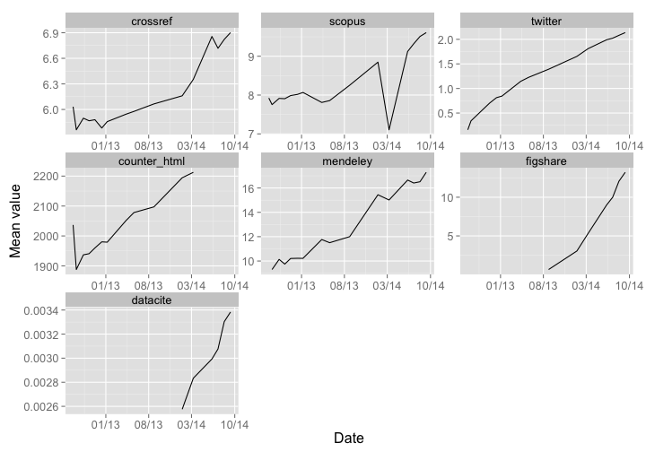

Summary of ALM data quality work
=============================

Article-level metrics data, like any other data, is subject to errors, inconsistencies, bias, etc. To that end, I've been doing some data quality work on article-level metrics data with PLOS. The goal was to explore data quality issues with article-level metrics data, using specifically the data collected on PLOS articles. 

There were two sets of data: 

* monthly reports - these are spreadsheet dumps basically of summary metrics for each data sources for every article.
* alerts data - The [Lagotto application](https://github.com/articlemetrics/lagotto/) has an alert system, that produces alerts for many things, and I'll explain some below


I'll do a high level summary of the findings from each set of data.

## Monthly reports

A file is created at the end of each month. It holds all DOI's published up to that month, including article level metrics. These files make it easy to analyze data for one particular month, or can be summed together to get a picture of PLOS altmetrics over many months (as I do below). You can find these files [on FigShare](http://figshare.com/articles/search?q=author%3A+PLOS%20ALM).

### Coverage

The monthly data covers:

* 16 months 
* Data from: 2012(07, 08, 09, 10, 11, 12), 2013(01, 04, 05, 08), 2014(01, 03, 06, 07, 08, 09)
* 128986 DOIs
* 43 article-level metrics variables

### Summary statistics

The below plots use the data from the `2014-03` file, across all DOIs. Sources are dropped below that have no data, or have a sum or mean of zero.

__Mean metric values__

You can see that some article-level metrics are on average larger than others, with, for example, `counter_html` (number of html page views) much higher than `twitter`. Of the social media data sources, `facebook` has higher mean values than `twitter`. Note that this is a partial list of metrics.

 

__Overview of some altmetrics variables through time (mean value across articles for each month before plotting)__

Through time, metrics show different patterns. Datacite citations was only brough online back in early 2014. Twitter has seen a steady increase, while Mendeley has been up and down but trending upwards. Note that each panel has a different y-axis, while the x-axes are the same.

 

__Distribution of the same subset of altmetrics variables (mean taken across dates for each article before plotting)__

These panels show a few different things. First, some data sources have much more data than others (e.g., compare Crossref to Datacite). Second, some data sources have a tight grouping of values around the mean (e.g., counter html), while others have long tails (e.g., Twitter). Note that each panel have different y- and x-axes - the y-axis is log base 10 number of articles, and x-axis is the metric value.

 

### Some patterns

As you'd expect, some metrics are correlated, and some are not so related. If some are tightly correlated, we can possibly predict what metric A may be simply by knowing metric B. For seven metrics, how are they related to one another? The below plot shows the relationships among counter (html+pdf views), Mendeley readers, Crossref citations, Facebook likes, Reddit shares, and Wikipedia mentions. 

 

## Alerts

The [Lagotto application](http://alm.plos.org/) collects and provides article-level metrics data for scholarly articles. As part of a data integrity process, various alerts are given from Lagotto that help determine what may be going wrong with the application, data sources used in Lagotto, and any problems with users requesting data from the Lagotto application. Analyzing these alerts helps to determine what errors are the most common, and what may lie behind errors.

I've been working on an R client to work with Lagotto application data, called [alm](https://github.com/ropensci/alm). This R client can also interact with alerts data from Lagotto. [Python](https://github.com/articlemetrics/pyalm) and [Ruby](https://github.com/articlemetrics/lagotto-rb) clients are also in the works. _Note that accessing alerts data takes an extra level of permissions_.

As other publishers are starting to use Lagotto, the below is a discussion mostly of PLOS data, but includes some discussion of other publishers. 

Alerts data can be used for many things. One potential use is discovering potetntial gaming activities. For example, the `EventCountIncreasingTooFastError` alert flags articles in which the event (e.g., Facebook likes) is increasing faster than some cutoff. These articles can then be investigated as to whether the event counts are justifiable or not. 

Another purpose can be called infrastructure purposes. Alerts like `Net::HTTPUnauthorized` are not useful for the purpose of detecting potential gaming, but are useful for the publisher using the Lagotto application. Alerts can help determine if there is a problem with one of the data sources, and why the error occurred. 

### How to interpret alerts (partial list)

|Alert class name                  | Description       |
|:---------------------------------|:------------------|
|Net::HTTPUnauthorized             | 401 - authorization likely missing |
|Net::HTTPRequestTimeOut           | 408 - request timeout |
|Net::HTTPConflict                 | 409 - Document update conflict |
|Net::HTTPServiceUnavailable       | 503 - service is down |
|Faraday::ResourceNotFound         | 404 - resource not found |
|ActiveRecord::RecordInvalid       | title is usually blank, and can't be |
|EventCountDecreasingError         | decrease too fast, check on it |
|EventCountIncreasingTooFastError  | increasing too fast, check on it |
|ApiResponseTooSlowError           | Alert if successful API responses took too long |
|HtmlRatioTooHighError             | HTML/PDF ratio higher than 50 |
|ArticleNotUpdatedError            | Alert if articles have not been updated within X days |
|CitationMilestoneAlert            | Alert if an article has been cited the specified number of times |

### PLOS

PLOS has 142,136 articles available in their Lagotto instance as of 2015-01-06. Most of the PLOS articles in the recent few weeks are `WorkNotUpdatedError` alerts - meaning works have not been updated recently. Most alerts have to do with infrastructure problems, not potential gaming problems.

|Class Name                   |     N|
|:----------------------------|-----:|
|WorkNotUpdatedError          | 17653|
|Net::HTTPServiceUnavailable  |   860|
|Net::HTTPNotFound            |   128|
|EventCountDecreasingError    |    69|
|Net::HTTPRequestTimeOut      |    15|
|Delayed::WorkerTimeout       |    12|
|NoMethodError                |     9|
|Faraday::ClientError         |     2|
|Net::HTTPInternalServerError |     2|

An interesting one is `EventCountDecreasingError`, which had 69 results. Let's dig in further, if we search for `EventCountDecreasingError` alerts from a single source (Web of Science, or `wos`) to simplify things.

```r
alm_alerts(class_name = "EventCountDecreasingError", per_page = 10)$data %>% 
    select(message, work)
```

|message                            |work                             |source        |
|:----------------------------------|:--------------------------------|:-------------|
|decreased from 2 to 1  |10.1371/journal.pone.0080825 |pmceurope     |
|decreased from 1 to 0  |10.1371/journal.pone.0101947 |pmceurope     |
|decreased from 1 to 0  |10.1371/journal.pone.0104703 |pmceurope     |
|decreased from 3 to 0  |10.1371/journal.ppat.1002565 |pmceuropedata |
|decreased from 2 to 1  |10.1371/journal.pone.0034257 |wos           |
|decreased from 81 to 0 |10.1371/journal.ppat.0010001 |wos           |
|decreased from 9 to 0  |10.1371/journal.ppat.0010003 |wos           |
|decreased from 13 to 0 |10.1371/journal.ppat.0010007 |wos           |
|decreased from 37 to 0 |10.1371/journal.ppat.0010008 |wos           |
|decreased from 21 to 0 |10.1371/journal.ppat.0010009 |wos           |

One of the highest offenders is the article `10.1371/journal.ppat.0010001` where WebofScience counts decreased from 81 to 0. Indeed, requesting metrics data for this DOI gives 0 for `wos`

```r
alm_ids("10.1371/journal.ppat.0010001")$data %>% filter(.id == "wos")
```

|.id | pdf| html| readers| comments| likes| total|
|:---|---:|----:|-------:|--------:|-----:|-----:|
|wos |  NA|   NA|      NA|       NA|    NA|     0|

### PKP

PKP has a growing collection of articles, with 158,368 as of 2015-01-06. An analysis on 2015-01-06 reveals that most of the alerts are `Net::HTTPForbidden` and `Net::HTTPClientError`. Again, as with PLOS, the message with alerts data is that most errors have to do with servers not responding at all, or too slowly, or some other technical error - but not an issue of potential gaming. 

|Class Name                     |     N|
|:------------------------------|-----:|
|Net::HTTPForbidden             | 23474|
|Net::HTTPClientError           | 13266|
|Net::HTTPServiceUnavailable    |  5281|
|DelayedJobError                |  4916|
|Faraday::ResourceNotFound      |  1565|
|Net::HTTPInternalServerError   |  1032|
|StandardError                  |   351|
|Net::HTTPRequestTimeOut        |   275|
|Net::HTTPNotAcceptable         |   201|
|TooManyErrorsBySourceError     |   143|
|Net::HTTPConflict              |    89|
|ActiveRecord::RecordInvalid    |    80|
|Net::HTTPBadRequest            |    54|
|NoMethodError                  |    12|
|ActiveRecord::StatementInvalid |    11|
|Net::HTTPBadGateway            |     7|
|ActionView::MissingTemplate    |     2|
