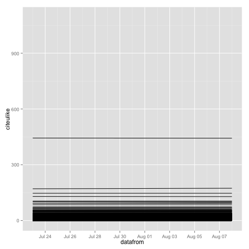
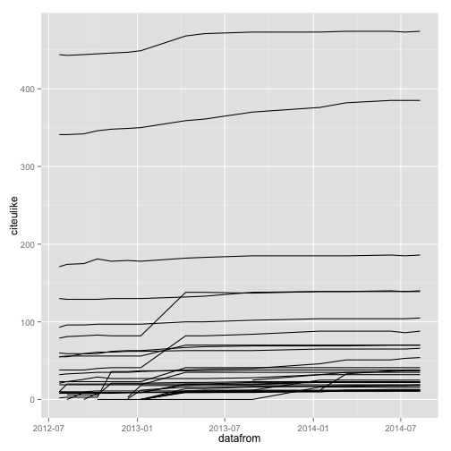

data-quality code
========================================================

## Install packages 

If the below packages are not installed already, then load package


```r
# install.packages(c('data.table','dplyr','stringr'))
# devtools::install_github("ropensci/alm", ref="alerts")
library('data.table')
library('dplyr')
library('stringr')
library('alm')
library('ggplot2')
```

## Read in data

PLOS folks, Monthly reports are in a Google Drive folder, talk to Martin


```r
setwd("~/Google Drive/ALM Monthly Reports/") 
files <- list.files(".", pattern = ".csv")
read_file <- function(x){
  tmp <- read.csv(x, header = TRUE, sep = ",", stringsAsFactors=FALSE)
  tmp$datafrom <- as.Date(str_extract(x, "[0-9]{4}-[0-9]{2}-[0-9]{2}"), "%Y-%m-%d")
  tmp
}
dat <- lapply(files, read_file)
alldat <- rbind_all(dat)
(dat2 <- tbl_df(alldat))
```

```
## Source: local data frame [1,271,304 x 51]
## 
##                             doi  published
## 1  10.1371/journal.pbio.0000001 2003-10-13
## 2  10.1371/journal.pbio.0000002 2003-11-17
## 3  10.1371/journal.pbio.0000003 2003-11-17
## 4  10.1371/journal.pbio.0000004 2003-10-13
## 5  10.1371/journal.pbio.0000005 2003-08-18
## 6  10.1371/journal.pbio.0000006 2003-08-18
## 7  10.1371/journal.pbio.0000007 2003-08-18
## 8  10.1371/journal.pbio.0000008 2003-10-13
## 9  10.1371/journal.pbio.0000009 2003-10-13
## 10 10.1371/journal.pbio.0000010 2003-10-13
## ..                          ...        ...
## Variables not shown: title (chr), bloglines (int), citeulike (int),
##   connotea (int), crossref (int), nature (int), postgenomic (int), pubmed
##   (int), researchblogging (int), scopus (int), twitter (int), counter_html
##   (int), counter_pdf (int), counter_xml (int), pmc_html (int), pmc_pdf
##   (int), facebook (int), mendeley_readers (int), mendeley_groups (int),
##   comments (int), comment_replies (int), notes (int), note_replies (int),
##   ratings (int), avg_rating (dbl), rating_comments (int), trackbacks
##   (int), datafrom (date), biod (int), counter (int), pmc (int), mendeley
##   (int), publication_date (chr), wikipedia (int), scienceseeker (int),
##   f1000 (int), figshare (int), pmceurope (int), pmceuropedata (int),
##   wordpress (int), reddit (int), datacite (int), articlecoveragecurated
##   (int), articlecoverage (int), plos_comments (int), relativemetric (int),
##   mendeley.1 (int), pmc.1 (int), counter.1 (int)
```

## Data manipulation


```r
# new column with date for each row, drop other pub date columns
# and move title to end for easier viewing
(dat2 <- dat2 %>%
  mutate(pubdate = published[1], title2 = title) %>%
  select(-published, -publication_date, -title))
```

```
## Source: local data frame [1,271,304 x 50]
## 
##                             doi bloglines citeulike connotea crossref
## 1  10.1371/journal.pbio.0000001         0         0        0        9
## 2  10.1371/journal.pbio.0000002         0         4        0       83
## 3  10.1371/journal.pbio.0000003         0         0        0        0
## 4  10.1371/journal.pbio.0000004         0         0        0        0
## 5  10.1371/journal.pbio.0000005         0        10        6      316
## 6  10.1371/journal.pbio.0000006         0         0        0       15
## 7  10.1371/journal.pbio.0000007         0         2        0        0
## 8  10.1371/journal.pbio.0000008         0         0        0        6
## 9  10.1371/journal.pbio.0000009         0         1        0        1
## 10 10.1371/journal.pbio.0000010         0        14        2      116
## ..                          ...       ...       ...      ...      ...
## Variables not shown: nature (int), postgenomic (int), pubmed (int),
##   researchblogging (int), scopus (int), twitter (int), counter_html (int),
##   counter_pdf (int), counter_xml (int), pmc_html (int), pmc_pdf (int),
##   facebook (int), mendeley_readers (int), mendeley_groups (int), comments
##   (int), comment_replies (int), notes (int), note_replies (int), ratings
##   (int), avg_rating (dbl), rating_comments (int), trackbacks (int),
##   datafrom (date), biod (int), counter (int), pmc (int), mendeley (int),
##   wikipedia (int), scienceseeker (int), f1000 (int), figshare (int),
##   pmceurope (int), pmceuropedata (int), wordpress (int), reddit (int),
##   datacite (int), articlecoveragecurated (int), articlecoverage (int),
##   plos_comments (int), relativemetric (int), mendeley.1 (int), pmc.1
##   (int), counter.1 (int), pubdate (chr), title2 (chr)
```

```r
# remove negative numbers in facebook
(dat2 <- dat2 %>%
  filter(facebook >= 0))
```

```
## Source: local data frame [1,271,200 x 50]
## 
##                             doi bloglines citeulike connotea crossref
## 1  10.1371/journal.pbio.0000001         0         0        0        9
## 2  10.1371/journal.pbio.0000002         0         4        0       83
## 3  10.1371/journal.pbio.0000003         0         0        0        0
## 4  10.1371/journal.pbio.0000004         0         0        0        0
## 5  10.1371/journal.pbio.0000005         0        10        6      316
## 6  10.1371/journal.pbio.0000006         0         0        0       15
## 7  10.1371/journal.pbio.0000007         0         2        0        0
## 8  10.1371/journal.pbio.0000008         0         0        0        6
## 9  10.1371/journal.pbio.0000009         0         1        0        1
## 10 10.1371/journal.pbio.0000010         0        14        2      116
## ..                          ...       ...       ...      ...      ...
## Variables not shown: nature (int), postgenomic (int), pubmed (int),
##   researchblogging (int), scopus (int), twitter (int), counter_html (int),
##   counter_pdf (int), counter_xml (int), pmc_html (int), pmc_pdf (int),
##   facebook (int), mendeley_readers (int), mendeley_groups (int), comments
##   (int), comment_replies (int), notes (int), note_replies (int), ratings
##   (int), avg_rating (dbl), rating_comments (int), trackbacks (int),
##   datafrom (date), biod (int), counter (int), pmc (int), mendeley (int),
##   wikipedia (int), scienceseeker (int), f1000 (int), figshare (int),
##   pmceurope (int), pmceuropedata (int), wordpress (int), reddit (int),
##   datacite (int), articlecoveragecurated (int), articlecoverage (int),
##   plos_comments (int), relativemetric (int), mendeley.1 (int), pmc.1
##   (int), counter.1 (int), pubdate (chr), title2 (chr)
```

## Through time

Compare each metric separately through time for the same DOIs

### Citeulike data


```r
citeulike <- dat2 %>% select(doi, datafrom, citeulike)
ggplot(citeulike[1:100000,], aes(datafrom, citeulike, group=doi)) +
  geom_line()
```

 

```r
# get dois that have at least a change in their value of 1  
citeu_dois <- dat2 %>% 
  select(doi, datafrom, citeulike) %>% 
  group_by(doi) %>% 
  summarise(
    diff = max(citeulike) - min(citeulike)
  ) %>% 
  filter(diff > 10) %>% 
  select(doi)

# Visualize data
dat2 %>% 
  select(doi, datafrom, citeulike) %>% 
  filter(doi %in% citeu_dois$doi) %>% 
  ggplot(aes(datafrom, citeulike, group=doi)) + geom_line()
```

 

## Across metrics

Compare different metrics across the same DOIs in one time slice


```r
# xxx
```
