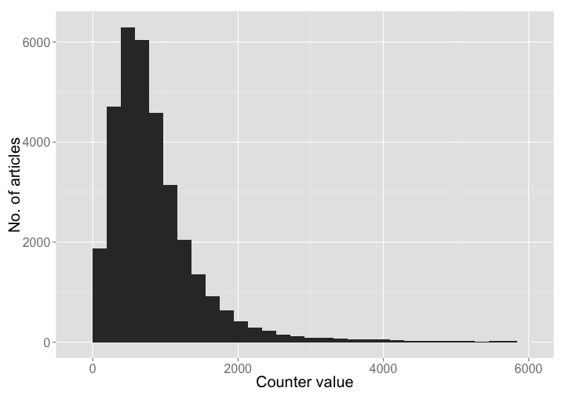
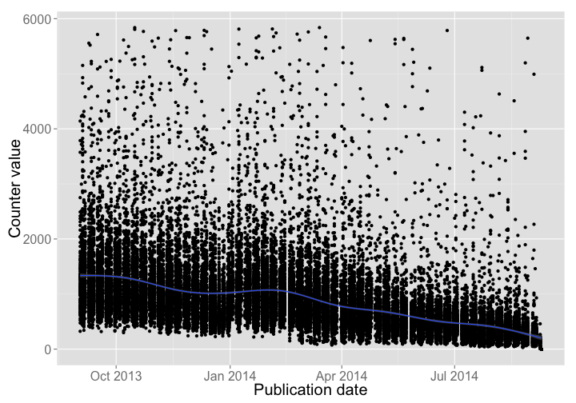

Article Level Metrics Report on PLOS One articles
========================================================


The following is a summary of PLOS One articles from September 2013 to September 2014. Data are from monthly files available via Martin Fenner/Jennifer Lin. The main response variable used below is `counter`, which is the combined PDF views (i.e., downloads) and HTML views on an article. The first few steps below read in the data, then clean up the data to get the subset we want. Then there are a few summary tables, and a few vizualizations. 

Prepared: 2014-10-14

## Install packages 

If the below packages are not installed already, install them, then load packages


```r
# install.packages(c('dplyr','stringr','ggplot2','knitr'))
library('dplyr')
library('stringr')
library('ggplot2')
library('knitr')
options(stringsAsFactors = FALSE)
```

## Read in data

PLOS folks, Monthly reports are in a Google Drive folder, talk to Martin if you want access, then change the path below to the location on your machine. This workflow in the future will read files from Figshare so that the data ingestion step is path independent. 


```r
dir <- getwd()
setwd("~/Google Drive/ALM Monthly Reports/")
dat <- read.csv("alm_report_2014-09-10.csv", header = TRUE, sep = ",", stringsAsFactors=FALSE)
dat2 <- tbl_df(dat)
setwd(dir)
```

## Data cleaning/preparation

remove annotation DOIs - NOTE: if you want these, don't run this next few lines of code


```r
annot <- dat2 %>% filter(grepl('annotation', doi)) %>% select(doi)
dat2 <- dat2 %>% 
   filter(!doi %in% annot$doi)
```

Get only articles from `September 2013` to `August 2014`. Make `publication_date` a date class first.


```r
dat2$publication_date <- as.Date(dat2$publication_date)
dat2 <- dat2 %>%
  filter(publication_date > "2013-08-30")
```

PLOS One articles only


```r
dat2 <- dat2 %>%
  filter(grepl("journal.pone", doi))
```

Take a quick look at the data, printing without the `title` field to look at more columns. There are 33814 rows (i.e., articles) and 27 columns in the dataset.


```r
dat2 %>%
  select(-title)
```

```
## Source: local data frame [33,814 x 26]
## 
##                             doi publication_date citeulike mendeley
## 1  10.1371/journal.pone.0000000       2014-08-18         4        6
## 2  10.1371/journal.pone.0070385       2013-10-21         0       12
## 3  10.1371/journal.pone.0068314       2013-09-02         0        3
## 4  10.1371/journal.pone.0068350       2013-09-02         0        3
## 5  10.1371/journal.pone.0070615       2013-09-02         0        8
## 6  10.1371/journal.pone.0070873       2013-09-02         0        5
## 7  10.1371/journal.pone.0070930       2013-09-02         0        2
## 8  10.1371/journal.pone.0071142       2013-09-02         0        6
## 9  10.1371/journal.pone.0071969       2013-09-02         0        3
## 10 10.1371/journal.pone.0071994       2013-09-02         0        1
## ..                          ...              ...       ...      ...
## Variables not shown: crossref (int), datacite (int), pmceurope (int),
##   pmceuropedata (int), pubmed (int), scopus (int), articlecoverage (int),
##   articlecoveragecurated (int), facebook (int), plos_comments (int),
##   nature (int), reddit (int), researchblogging (int), scienceseeker (int),
##   twitter (int), wikipedia (int), wordpress (int), counter (int), figshare
##   (int), pmc (int), relativemetric (int), f1000 (int)
```


## Data summary

All data is the `counter` variable

95% of the data are less than 5842 value of `counter`, so let's just look at the top 99% of the data to get a better look at the data.


```r
df <- dat2 %>%
  filter(counter < quantile(dat2$counter, probs = c(0.99))[[1]])
```

### Summary tables

Summary across all articles


```r
df2 <- df %>%
  summarise(min = min(counter, na.rm = TRUE), 
            max = max(counter, na.rm = TRUE), 
            meamean = round(mean(counter, na.rm = TRUE), 1), 
            sd = round(sd(counter, na.rm = TRUE), 1),
            se = round(sd(counter, na.rm = TRUE) / sqrt(length(counter)), 1),
            no_articles = length(counter))

kable(df2, "markdown")
```


| min|  max| meamean|    sd|  se| no_articles|
|---:|----:|-------:|-----:|---:|-----------:|
|   0| 5838|   858.8| 669.9| 3.7|       33474|

Summary by month


```r
add_yrmonth <- function(x) paste(strsplit(as.character(x), "-")[[1]][1:2], collapse = "-")
df$yr_month <- sapply(df$publication_date, add_yrmonth)

df3 <- df %>%
  group_by(yr_month) %>%
  summarise(min = min(counter, na.rm = TRUE), 
            max = max(counter, na.rm = TRUE), 
            mean = round(mean(counter, na.rm = TRUE), 1), 
            sd = round(sd(counter, na.rm = TRUE), 1),
            se = round(sd(counter, na.rm = TRUE) / sqrt(length(counter)), 1),
            no_articles = length(counter))

kable(df3, "markdown")
```


|yr_month | min|  max|   mean|    sd|   se| no_articles|
|:--------|---:|----:|------:|-----:|----:|-----------:|
|2013-09  | 319| 5713| 1323.6| 738.0| 14.2|        2698|
|2013-10  | 299| 5838| 1285.8| 760.8| 14.8|        2655|
|2013-11  | 242| 5783| 1098.1| 677.1| 12.6|        2870|
|2013-12  | 227| 5788|  954.1| 603.5| 11.0|        3006|
|2014-01  | 220| 5811| 1109.0| 674.4| 12.4|        2971|
|2014-02  | 109| 5813| 1032.2| 665.3| 13.0|        2625|
|2014-03  |  74| 5838|  867.5| 581.2| 10.7|        2965|
|2014-04  |  97| 5604|  753.1| 536.8| 10.2|        2791|
|2014-05  |  91| 5642|  644.2| 497.9| 10.2|        2375|
|2014-06  |  79| 5785|  512.9| 393.9|  7.6|        2672|
|2014-07  |  43| 5114|  432.7| 431.2|  8.6|        2511|
|2014-08  |  32| 5646|  363.6| 368.9|  7.3|        2588|
|2014-09  |   0| 4991|  182.1| 257.7|  9.4|         747|

### Vizualize data

The distribution of `counter` as a histogram


```r
df %>%
  ggplot(aes(x = counter)) +
    geom_histogram() +
    theme_grey(base_size = 20) +
    labs(y = "No. of articles", x = "Counter value")
```

 

The value of `counter` for each article decreases through time


```r
df %>%
  ggplot(aes(x = publication_date, y = counter)) +
    geom_point() +
    geom_smooth() +
    theme_grey(base_size = 20) +
    labs(y = "Counter value", x = "Publication date")
```

 

