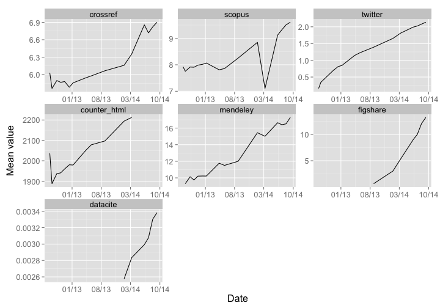

Summary of ALM montly reports
=============================

__Scott Chamberlain__
__03 November, 2014__

## Introduction

A file is created at the end of each month. It holds each DOI's published from that month, including article level metrics summed for each DOI for the month. These files make it easy to analyze data for one particular month, or can be summed together to get a picture of PLOS altmtrics over many months (as I do below). 

## Coverage

The monthly data covers:

* 16 months 
* Data from: 2012(07, 08, 09, 10, 11, 12), 2013(01, 04, 05, 08), 2014(01, 03, 06, 07, 08, 09)
* 128986 DOIs
* 43 article-level metrics variables

## Summary statistics

Totals of metrics for 2014-03, across all DOIs. Newer monthly files are missing some data. Sources are dropped below that have no data, or have a sum or mean of zero.

__Sum__

 

__Mean__

 

Overview of some altmetrics through time

 
